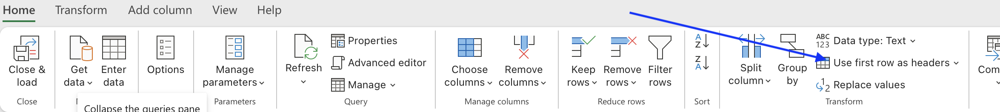
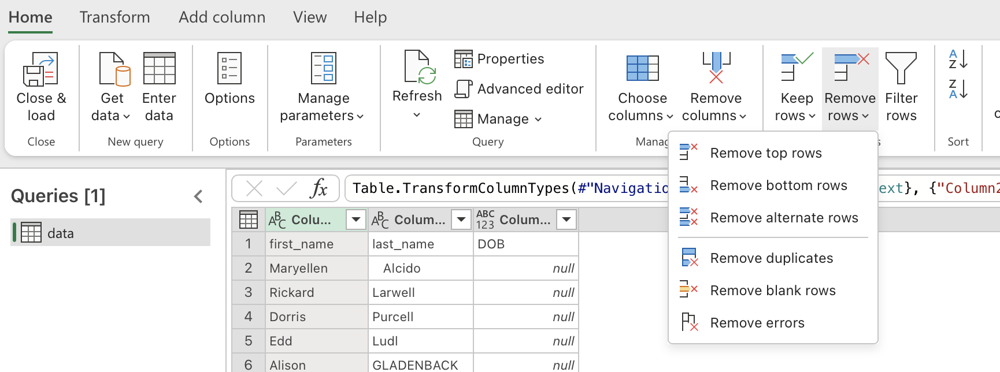

# Power Query Transformations

Power Query allows us to clean and transform data to get ready for analysis.  It allows us to apply transformations in steps, which can be repeated whenever new data arrives.

## Why Steps Matter

Because every transformation is recorded:

- Work can be repeated
- Work can be reviewed
- Errors can be corrected
- Queries can be refreshed

This is one of Power Query's major advantages over manual Excel cleaning.


??? abstract "Click to show image"
    

---
## Setting a header row

Often data is exported with a header row that is not recognised by Power Query.  We can manually set the header row to ensure that column names are meaningful.  this is done by selecting the `Use First Row as Headers` option in the ribbon.


??? abstract "Click to show image"
    

**Activity**
From the `names.xlsx` workbook that was loaded into Power Query from the previous module, set the first row as headers.

---

## Removing Rows

One of the most common transformations.

### Remove Blank Rows

**Before**

| Name |
|--------|
| Sarah |
| David |
| |
| Minh |

**After**

| Name |
|--------|
| Sarah |
| David |
| Minh |


### Remove Top Rows

Useful when reports contain:

- Titles
- Export information
- Notes

**Example**

```text
Youth Survey Report
Generated 1 March 2026
```

These rows can be removed before analysis.

### Remove Bottom Rows

Useful when reports contain:

- Totals
- Notes
- Summary information

**Example**

```text
Grand Total
Records Exported
```

### Removing Duplicates

Duplicates are common in imported data.

**Before**

| ResponseID |
|------------|
| R001 |
| R001 |
| R002 |

**After**

| ResponseID |
|------------|
| R001 |
| R002 |

Always review duplicates before removing them.


??? abstract "Click to show image"
    

**Activity**
There are blank rows in the `names.xlsx` workbook that was opened in Power Query.  Remove the blank rows, duplicates and any other rows that are not useful.

??? note "Tip"
    To check if duplicates or blanks exist before removing them choose the relevent option/s in the *Keep Rows* section of the ribbon.  This will filter the data to show only the duplicates or blanks.  You can then review the data before removing them.


---

## Removing Columns

Many datasets contain unnecessary information.

**Example**

**Before**

| Name | Phone | Fax Number | Legacy ID |
|--------|--------|--------|--------|

**After**

| Name | Phone |
|--------|--------|

Removing unused columns:

- Simplifies analysis
- Improves performance
- Reduces clutter

**Activity**
Remove the unused column from the `names.xlsx` workbook that was opened in Power Query.

---

## Right Click Menu

Clicking on a column header opens a menu with many useful options.  Some of these are outlined below.

### Renaming Columns

Column names should be meaningful.

**Before**

| Column1 | Column2 | Column3 |
|----------|----------|----------|

**After**

| Name | Age | Suburb |
|--------|--------|--------|

Good naming improves readability and maintainability.

---

### Changing Data Types

Power Query automatically attempts to detect data types.

Common data types include:

- Text
- Whole Number
- Decimal Number
- Date
- Time
- True/False

**Why Data Types Matter**

Consider:

```text
100
```

If stored as text:

```text
"100"
```

calculations may fail.

Correct data types improve:

- Sorting
- Filtering
- Calculations
- Reporting

---

### Replacing Values

One of the most useful transformations.

**Example**

**Before**

```text
Victoria
VIC
vic
```

**After**

```text
VIC
VIC
VIC
```

**Survey Example**

**Before**

```text
YES
Yes
Y
```

**After**

```text
Yes
Yes
Yes
```

**Activity**
Use the right click menu to replace the values in the `names.xlsx` workbook that was opened in Power Query.  Rename columns appropriately and change data types where necessary.  Standardise column data where appropriate.

---

## Filtering Data

Filtering can remove irrelevant records.

**Example**

Keep only:

```text
VIC
```

records.

Or remove:

```text
Blank values
```

records.

---

## Sorting Data

Sorting helps identify:

- Missing values
- Duplicates
- Outliers
- Invalid values

**Example**

Sort Age:

```text
-1
12
14
15
250
```

The unusual values become obvious.

---

## Splitting Columns

Columns sometimes contain multiple values.

**Example**

**Before**

```text
Broadmeadows, VIC
```

**After**

| Suburb | State |
|---------|---------|
| Broadmeadows | VIC |

Power Query can split columns using:

- Delimiters
- Fixed widths
- Positions

**Activity**
Split up the location column in the `names.xlsx` workbook that was opened in Power Query.

---

## Merging Columns

The opposite of splitting.

**Before**

| First Name | Last Name |
|------------|------------|

**After**

| Full Name |
|-----------|

Useful when creating display fields.

---

## Creating New Columns

Power Query can generate new columns from existing data.

**Example**

Age:

```text
16
```

Create:

```text
Age Group
```

Result:

```text
15-17
```

---

## Understanding Query Refresh

One of the biggest advantages of Power Query is refreshability.

**Example**

Original file:

```text
100 records
```

Next month:

```text
500 records
```

Instead of repeating the entire process:

1. Replace the source file
2. Refresh query

Power Query reapplies all transformation steps.

---

## Loading Results Back into Excel

Once transformations are complete:

### Close & Load

Loads data into:

- Excel Worksheet
- Excel Table

### Close & Load To

Allows loading into:

- Pivot Tables
- Data Model
- Existing worksheets

---

## Activity

- Apply the above tranformations to the [names2](../../assets/names2.xlsx) file.  Once complete, load the results into a new worksheet in Excel.
- Apply the query created for `names2.xlsx` to [names3](../../assets/names3.xlsx).  Refresh the query to see the results.
