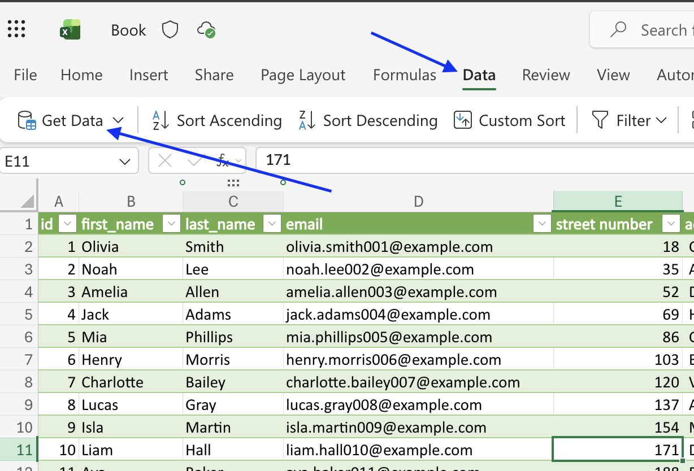
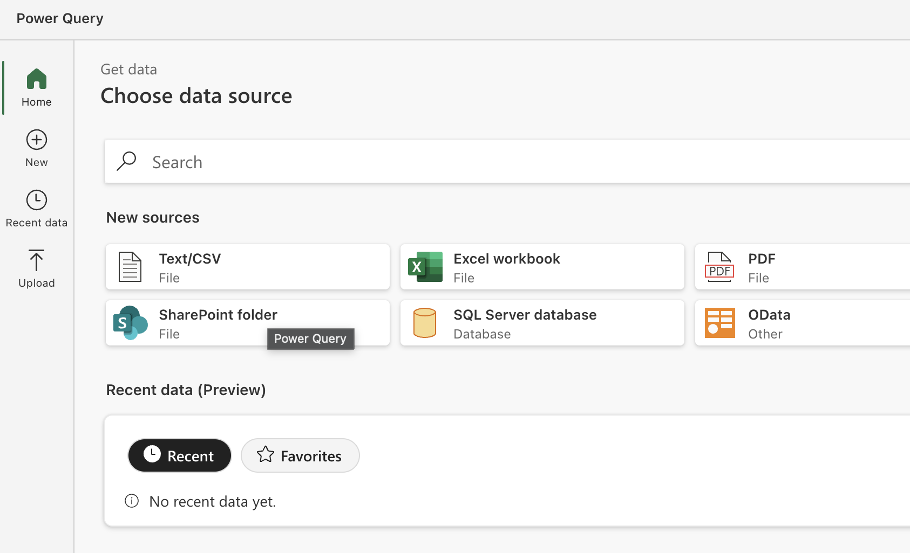
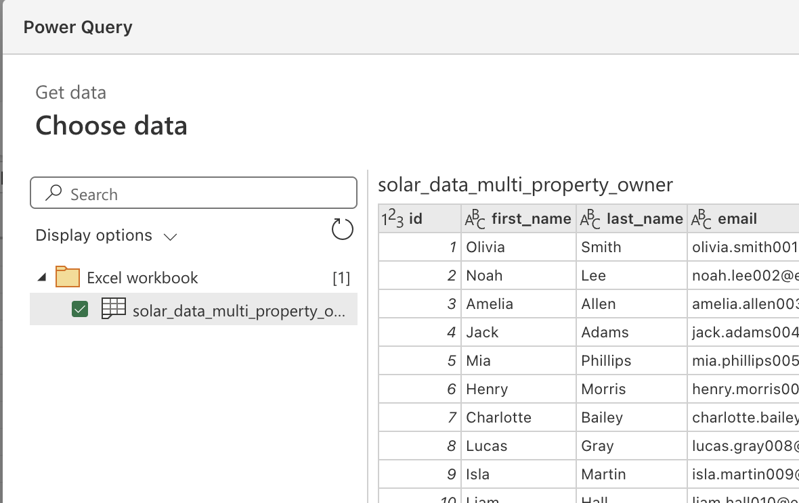
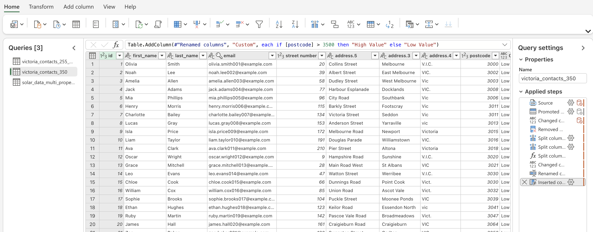
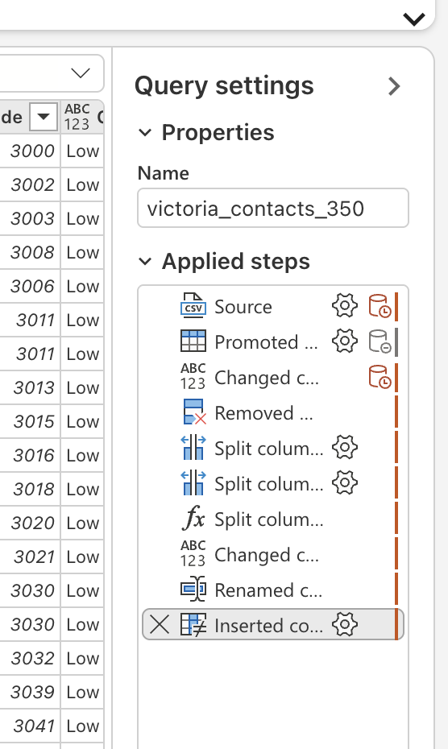
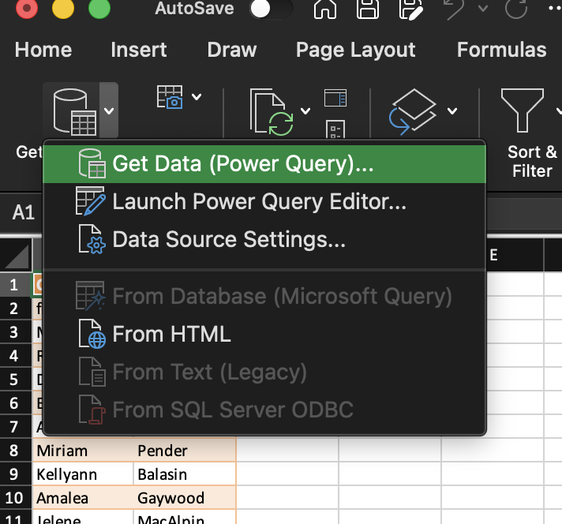

# Power Query Fundamentals

## Introduction

As datasets become larger and more complex, manual cleaning in Excel becomes time consuming and difficult to repeat.

Power Query allows us to create repeatable data transformation workflows that can be refreshed whenever new data becomes available.

Instead of cleaning data manually every time, we can build a transformation process once and reuse it.

By the end of this module, you will be able to:

- Load data into Power Query
- Understand query steps
- Perform common transformations
- Apply transformations consistently
- Refresh transformed datasets when source data changes

---

## What is Power Query?

Power Query is a data transformation and preparation tool built into Microsoft Excel.

It allows users to:

- Import data
- Clean data
- Transform data
- Combine data
- Prepare data for analysis

Rather than modifying source data directly, Power Query records the transformation steps you apply.

These steps can then be replayed whenever data is refreshed.

---

## Why Use Power Query?

Consider the following task:

Every month you receive:

- A new spreadsheet
- Different records
- Similar structure

You could manually:

- Delete blank rows
- Remove unnecessary columns
- Standardise values
- Remove duplicates

every month.

Or you could create a Power Query transformation once and simply refresh it each month.

### Benefits of Power Query

- Repeatable
- Automated
- Auditable
- Refreshable
- Handles large datasets
- Reduces human error
- Saves time

---

## Understanding the ETL Process

Power Query primarily supports the Transform phase of ETL.

### Extract

Data is collected from a source.

**Examples**

- Excel workbook
- CSV file
- Database
- Website

### Transform

Data is cleaned and standardised.

**Examples**

- Remove blanks
- Rename columns
- Standardise formats
- Remove duplicates

### Load

The cleaned data is loaded into:

- Excel tables
- Pivot Tables
- Pivot Charts
- Power BI
- Databases

---

## Accessing Power Query

In Excel:

```text
Data
→ Get Data
```

Common data sources include:

- Excel Workbook
- CSV
- Text Files
- Folder
- Database
- Web

??? abstract "Click to show image"
    

---

## Loading an Excel Worksheet

**Example**

Source workbook:

```text
YouthSurvey.xlsx
```

Contains:

```text
Responses
```

worksheet.

Power Query allows us to import the worksheet directly into a query.

### Steps

1. Data
2. Get Data
3. From Workbook
4. Select workbook
5. Select worksheet
6. Transform Data

The Power Query Editor opens.

??? abstract "Click to show image"
    

??? abstract "Click to show image"
    

---

## Understanding the Query Editor

The Query Editor is where transformations occur.

The main areas are:

### Preview Window

Displays the current data.

### Queries Pane

Displays available queries.

### Applied Steps

Displays all transformations that have been applied.

### Ribbon

Contains transformation tools.


??? abstract "Click to show image"
    

---

## Understanding Applied Steps

Every action in Power Query becomes a step.

**Example Workflow**

```text
Source
```

↓

```text
Remove Blank Rows
```

↓

```text
Remove Columns
```

↓

```text
Rename Columns
```

↓

```text
Remove Duplicates
```

Each transformation appears in the Applied Steps panel.


??? abstract "Click to show image"
    

---

## Activity: Load and Inspect Data

Download the Excel workbook of names [here](../../assets/names.xlsx)

Load the names into Power Query.  We will use this loaded data set in the next module.

!!! note "Tip"
    If you end up back in the Excel workbook instead of the Power Query Editor, click `Data → Get Data → Launch Power Query Editor` to get back to the Power Query Editor.

??? abstract "Click to show image"
    
