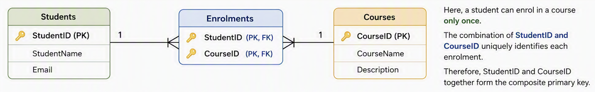
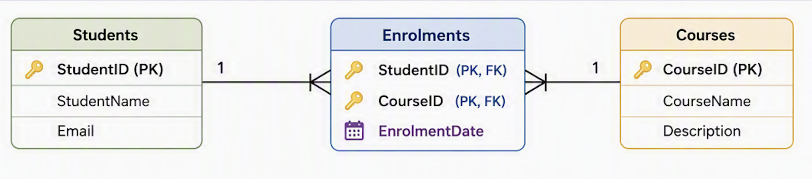

# Composite Keys

## Introduction

In most database tables, a **primary key** is a single field that uniquely identifies each record.

For example, in a Students table, `StudentID` might be the primary key.

However, sometimes one field by itself is not enough to uniquely identify a record. In these situations, a table can use a **composite key**.

---

## What is a Composite Key?

A **composite key** is a primary key made up of two or more fields.

The combination of these fields must uniquely identify each record in the table.

A composite key is useful when:

- No single field uniquely identifies a record
- Two or more fields together create a unique combination
- A linking table is used to connect two related tables

---

## Students and Courses Example

Consider a database that stores students and courses.

A student can enrol in many courses.

A course can have many students.

This creates a many-to-many relationship between Students and Courses.

To manage this relationship, we use an Enrolments table.

---

## Students Table

| StudentID | StudentName | Email |
|----------|-------------|-------|
| S001 | Sarah Lee | sarah@example.com |
| S002 | David Brown | david@example.com |

In this table, `StudentID` is the primary key.

---

## Courses Table

| CourseID | CourseName |
|----------|------------|
| C001 | Database Fundamentals |
| C002 | Power BI Basics |

In this table, `CourseID` is the primary key.

---

## Enrolments Table Without EnrolmentID

Instead of creating a separate `EnrolmentID`, the Enrolments table can use both `StudentID` and `CourseID` together as the primary key.

| StudentID | CourseID |
|----------|----------|
| S001 | C001 |
| S001 | C002 |
| S002 | C001 |

In this table:

- `StudentID` is a foreign key from the Students table
- `CourseID` is a foreign key from the Courses table
- `StudentID` and `CourseID` together form the composite primary key

---

## Why Use StudentID and CourseID Together?



A single `StudentID` is not unique in the Enrolments table because one student can enrol in multiple courses.

| StudentID | CourseID |
|----------|----------|
| S001 | C001 |
| S001 | C002 |

A single `CourseID` is also not unique because many students can enrol in the same course.

| StudentID | CourseID |
|----------|----------|
| S001 | C001 |
| S002 | C001 |

However, the combination of `StudentID` and `CourseID` is unique.

| StudentID | CourseID |
|----------|----------|
| S001 | C001 |
| S001 | C002 |
| S002 | C001 |

This means:

```text
StudentID + CourseID = Unique Enrolment
```

---

## Composite Key Example

In the Enrolments table, the composite key would be:

```text
StudentID + CourseID
```

This means the same student cannot be enrolled in the same course more than once.

For example, this would be allowed:

| StudentID | CourseID |
|----------|----------|
| S001 | C001 |
| S001 | C002 |

But this would not be allowed:

| StudentID | CourseID |
|----------|----------|
| S001 | C001 |
| S001 | C001 |

The second example creates a duplicate composite key.

---

## What if a Student Can Enrol in the Same Course More Than Once?

Sometimes a student may need to enrol in the same course more than once.

For example:

- The student repeats a course
- The course runs in different semesters
- The student enrols in the same course in different years
- The student withdraws and later re-enrols

In this situation, `StudentID` and `CourseID` alone are no longer enough.

---

## Problem Example

| StudentID | CourseID |
|----------|----------|
| S001 | C001 |
| S001 | C001 |

This creates a problem because both records have the same composite key.

The database cannot tell the two enrolments apart.

---

## Adding EnrolmentDate

To solve this, we can add another field such as `EnrolmentDate`.

| StudentID | CourseID | EnrolmentDate |
|----------|----------|---------------|
| S001 | C001 | 10/02/2026 |
| S001 | C001 | 15/07/2026 |

Now the composite key can be:

```text
StudentID + CourseID + EnrolmentDate
```

This allows the same student to enrol in the same course more than once, as long as the enrolment date is different.

---

## Composite Key With Date



The Enrolments table now contains a three-field composite key.

| StudentID | CourseID | EnrolmentDate |
|----------|----------|---------------|
| S001 | C001 | 10/02/2026 |
| S001 | C001 | 15/07/2026 |
| S002 | C001 | 10/02/2026 |

In this version:

- `StudentID` identifies the student
- `CourseID` identifies the course
- `EnrolmentDate` identifies the specific enrolment instance

Together, the three fields uniquely identify each enrolment.

---

## When Should You Use a Composite Key?

A composite key is useful when a natural combination of fields uniquely identifies a record.

In the students and courses example:

```text
StudentID + CourseID
```

works if a student can only enrol in a course once.

But if a student can enrol in the same course multiple times, we may need:

```text
StudentID + CourseID + EnrolmentDate
```

---

## Composite Key Compared to Surrogate Key

Another option is to create a separate ID field, such as `EnrolmentID`.

This is called a **surrogate key**.

Example:

| EnrolmentID | StudentID | CourseID | EnrolmentDate |
|------------|----------|----------|---------------|
| E001 | S001 | C001 | 10/02/2026 |
| E002 | S001 | C001 | 15/07/2026 |

Both approaches can be valid.

A composite key uses existing meaningful fields.

A surrogate key creates a new unique identifier.

---

## Key Idea

A composite key is used when multiple fields are needed to uniquely identify a record.

In an Enrolments table:

```text
StudentID + CourseID
```

can uniquely identify an enrolment if a student can only enrol in a course once.

If a student can enrol in the same course more than once, we may need:

```text
StudentID + CourseID + EnrolmentDate
```

---

## Knowledge Check

1. What is a composite key?
2. Why might the Enrolments table not need an EnrolmentID?
3. Why is `StudentID` alone not enough to identify an enrolment?
4. Why is `CourseID` alone not enough to identify an enrolment?
5. What fields could form the composite key in an Enrolments table?
6. What issue occurs if a student can enrol in the same course more than once?
7. How can adding `EnrolmentDate` help solve this issue?

---

## Summary

A composite key is a primary key made up of two or more fields.

In a Students and Courses database, the Enrolments table can use `StudentID` and `CourseID` together as a composite primary key.

This works when a student can only enrol in each course once.

If a student can enrol in the same course more than once, another field such as `EnrolmentDate` can be added to the composite key.

Composite keys are useful because they allow a database to uniquely identify records without always needing to create a separate ID field.
