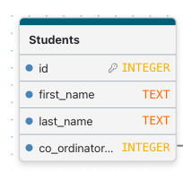
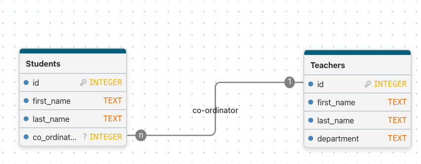
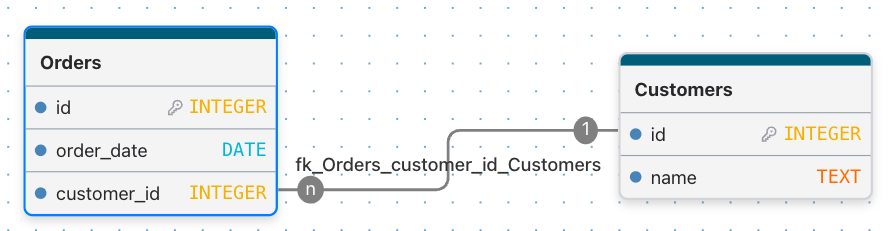
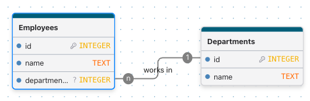

# Entity Relationship Diagrams (ERDs)

## Introduction

As databases grow, it becomes increasingly important to understand how data is organised and connected.

An **Entity Relationship Diagram (ERD)** is a visual tool used to plan and design databases before they are built. ERDs help database designers identify the tables required, the information stored in each table, and the relationships between them.

By creating an ERD before developing a database, organisations can reduce errors, improve data quality, and create more efficient database structures.

---

## Tools

[DrawDB](https://www.drawdb.app/)

---

## What is an ERD?

An **Entity Relationship Diagram (ERD)** is a visual representation of the structure of a database.

An ERD shows:

- Tables (Entities)
- Fields (Attributes)
- Relationships between tables
- Primary Keys
- Foreign Keys

ERDs provide a blueprint for how data will be stored and connected.  An ERD is constructed using business rules and requirements to ensure the database meets the needs of the organisation.

Unfortunately, there is not one standardised way to draw ERDs.  Different organisations and software tools use different notations.  However, the concepts are the same.  A good place to start to explore some of the notation is [Lucid Chart ER diagram symbols and notation](https://lucid.co/diagram/erd/symbols-and-notation) 


---

## Tables and Entities

In ERD terminology, a **table** is often referred to as an **entity**.

An entity represents a person, place, object, event, or concept that the organisation needs to store information about.

**Examples of Entities**

For a school database:

- Students
- Teachers
- Courses
- Enrolments

For an online store:

- Customers
- Products
- Orders
- Suppliers

Each entity becomes a table in the database.

---

## Attributes

Attributes are the pieces of information stored about an entity.

For example, a Student entity might contain:

| Student |
|----------|
| StudentID |
| FirstName |
| LastName |
| Email |
| DateOfBirth |

Each attribute becomes a column within a database table.

---

## Example Entity



In this example:

- Students is the entity (table)
- StudentID, FirstName, LastName and Email are attributes (fields)

---

## Relationships

A relationship describes how data in one table connects to data in another table.

Relationships allow databases to store information efficiently without unnecessary duplication.

For example:

- A teacher teaches students
- A customer places orders
- A department employs staff

Rather than storing all data in a single table, relationships allow related information to be stored separately and connected when needed.

---

## Primary Keys

A **Primary Key (PK)** is a field that uniquely identifies each record in a table.

Every table should have a primary key.

**Characteristics of a Primary Key**

- Unique
- Cannot be blank
- Identifies one record only

**Example**

**Students Table**

| StudentID (PK) | FirstName | LastName |
|----------------|------------|------------|
| 1001 | Sarah | Lee |
| 1002 | David | Brown |
| 1003 | Emma | Green |

StudentID uniquely identifies each student.

No two students should have the same StudentID.

---

## Foreign Keys

A **Foreign Key (FK)** is a field that creates a link between two tables.

- A foreign key stores the primary key value from another table.
- A foreign key must be that same data type as the key that in reference.
- A foreign key may be null, *if* the business rules allow it.

This connection allows related data to be retrieved without storing duplicate information.

**Example**

**Teachers Table**

| TeacherID (PK) | TeacherName |
|----------------|-------------|
| T01 | John Smith |
| T02 | Karen Jones |

**Students Table**

| StudentID (PK) | StudentName | TeacherID (FK) |
|----------------|-------------|----------------|
| 1001 | Sarah Lee | T01 |
| 1002 | David Brown | T01 |
| 1003 | Emma Green | T02 |

TeacherID is a foreign key in the Students table.

The value stored in TeacherID refers back to the primary key in the Teachers table.

---

## One-to-Many Relationships

A one-to-many relationship exists when:

- One record in Table A can be related to many records in Table B.
- A record in Table B can only be related to one record in Table A.

This is the most common relationship type in relational databases.

---

**Examples**

One Teacher, Many Students

```
Teacher
   |
   +-- Student
   +-- Student
   +-- Student
   +-- Student
```

One teacher can teach many students.

Each student is assigned to only one teacher.

**One Customer, Many Orders**

```
Customer
   |
   +-- Order
   +-- Order
   +-- Order
```

One customer can place multiple orders.

Each order belongs to a single customer.

---

## ERD Example: One-to-Many Relationship



The notation shows:

- One Teacher
- Many Students

The TeacherID foreign key enables the relationship.

---

## Reading an ERD

Consider the ERD below:



This ERD tells us:

- Customers and Orders are entities.
- CustomerID is the primary key in Customers.
- OrderID is the primary key in Orders.
- CustomerID is a foreign key in Orders.
- One customer can have many orders.
- Each order belongs to one customer.

---

## Why ERDs Are Important

ERDs help database designers:

- Visualise database structures before building them
- Identify relationships between tables
- Communicate database designs to stakeholders
- Detect design issues early

Well-designed ERDs often lead to more efficient and reliable databases.

---

## Activity: Identify Keys and Relationships

Examine the ERD below.



**Questions**

1. What is the primary key in the Departments table?
2. What is the primary key in the Employees table?
3. Which field is the foreign key?
4. What type of relationship is shown?
5. How many employees can belong to one department?
6. Can an employee belong to multiple departments?

---

## Class Activity: Krispy Kaos Donut Shop

Krispy Kaos is a growing donut shop chain with multiple store locations. Each store employs several staff members who assist with preparing, cooking, and selling donuts throughout the day.

To ensure fresh products are always available, staff regularly create donut batches. Each batch records information about the type of donut produced, the production time, and the quantity made.

To maintain quality standards, quality inspections are performed on donut batches. A batch may have multiple quality checks recorded throughout the day, including notes about appearance, freshness, and taste.

Krispy Kaos wants a system that can track stores, employees, donut production, and quality inspections to help improve consistency across all locations.

---

## Class Activity: Crashy Chaos Car Repair Garage

Crashy Chaos is a busy vehicle repair garage that specialises in collision repairs and general vehicle maintenance. Customers can own multiple vehicles, and each vehicle may be brought in for repairs many times over its lifespan.

Whenever a vehicle arrives at the garage, a repair job is created. The repair job records information such as the booking date, repair type, estimated cost, and completion status.

During the repair process, mechanics may add service notes describing inspections, work completed, parts replaced, or recommendations for future maintenance. A repair job can have multiple service notes recorded against it.

Crashy Chaos wants to maintain accurate records of customers, vehicles, repair jobs, and technician notes so staff can easily view a vehicle's repair history.

---

## Knowledge Check

1. What is an Entity Relationship Diagram (ERD)?
2. What is an entity?
3. What is an attribute?
4. What is a primary key?
5. What is a foreign key?
6. What is a one-to-many relationship?
7. Why are ERDs useful when designing databases?

---

## Summary

Entity Relationship Diagrams (ERDs) are used to plan and visualise database structures.

Key concepts include:

- **Entities** represent tables.
- **Attributes** represent columns within tables.
- **Primary Keys (PKs)** uniquely identify records.
- **Foreign Keys (FKs)** connect tables together.
- **Relationships** define how data is linked.
- **One-to-Many relationships** allow a single record in one table to be connected to multiple records in another table.

Understanding ERDs is a fundamental step in learning database design and creating efficient, well-structured databases.
