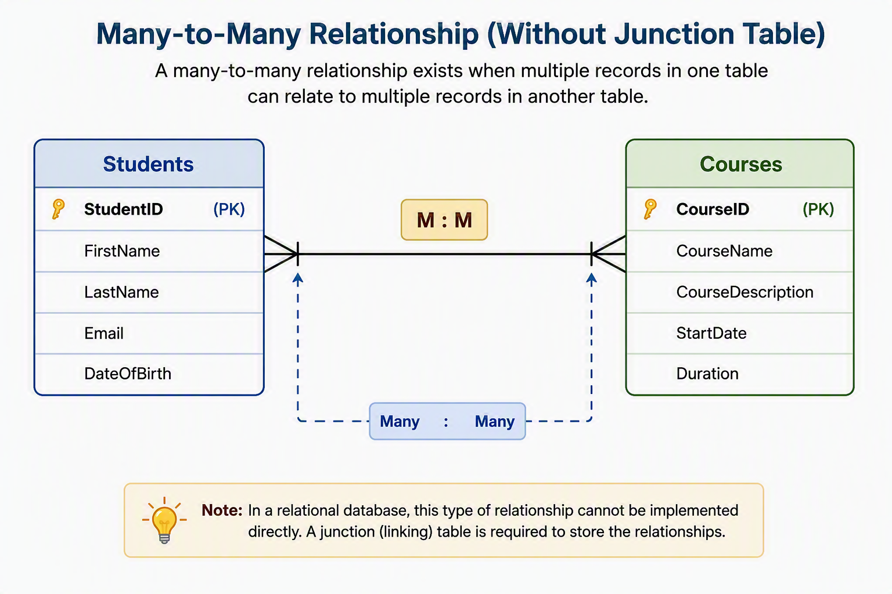
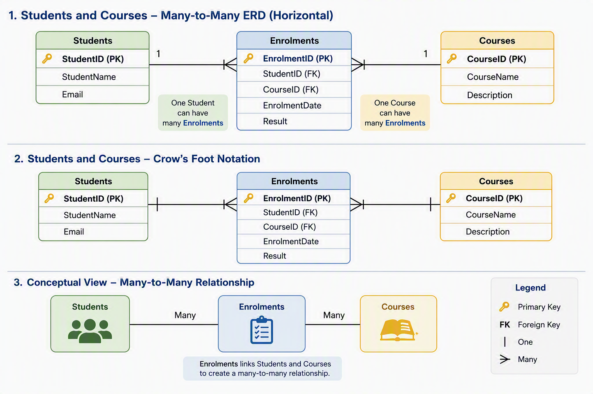

# Many-to-Many Relationships

## Introduction

As databases become more complex, some situations cannot be represented using a simple one-to-many relationship.

For example:

- Students can enrol in multiple courses.
- Courses can have multiple students.
- Products can appear on multiple orders.
- Orders can contain multiple products.

These situations require a **many-to-many relationship**.

Understanding many-to-many relationships is an important part of database design and Entity Relationship Diagrams (ERDs).

---

## What is a Many-to-Many Relationship?

A many-to-many relationship exists when:

- One record in Table A can be related to many records in Table B.
- One record in Table B can also be related to many records in Table A.

**Simple Example**

Consider a school.

A student can enrol in multiple courses.

```
Sarah
 ├─ Database Fundamentals
 ├─ Excel Essentials
 └─ Power BI Basics
```

A course can also contain multiple students.

```
Database Fundamentals
 ├─ Sarah
 ├─ David
 ├─ Emma
 └─ Michael
```

Because both sides can have multiple connections, this is a many-to-many relationship.



---

## Real-World Examples

**Students and Courses**

- One student can enrol in many courses.
- One course can contain many students.

**Customers and Products**

- One customer can purchase many products.
- One product can be purchased by many customers.

**Employees and Projects**

- One employee can work on many projects.
- One project can involve many employees.

**Authors and Books**

- One author can write many books.
- One book can have multiple authors.

---

## Why Can't We Connect Them Directly?

Imagine the following tables:

**Students**

| StudentID | StudentName |
|------------|-------------|
| 1001 | Sarah Lee |
| 1002 | David Brown |

**Courses**

| CourseID | CourseName |
|------------|------------|
| C01 | Database Fundamentals |
| C02 | Power BI Basics |

If Sarah studies both courses, where would we store this information?

Adding multiple CourseIDs into a single field creates problems.

| StudentID | StudentName | CourseIDs |
|------------|-------------|-----------|
| 1001 | Sarah Lee | C01, C02 |

This makes searching, filtering, and reporting much more difficult.

Relational databases are designed to avoid this type of structure.

---

## The Solution: A Junction Table

To create a many-to-many relationship, a third table is introduced.

This table is commonly called a:

- Junction Table
- Linking Table
- Bridge Table

The junction table stores the relationship between the two entities.

---

## Example: Students and Courses

**Students**

| StudentID (PK) | StudentName |
|----------------|-------------|
| 1001 | Sarah Lee |
| 1002 | David Brown |

**Courses**

| CourseID (PK) | CourseName |
|----------------|------------|
| C01 | Database Fundamentals |
| C02 | Power BI Basics |

**Enrolments**

| EnrolmentID (PK) | StudentID (FK) | CourseID (FK) |
|------------------|----------------|---------------|
| 1 | 1001 | C01 |
| 2 | 1001 | C02 |
| 3 | 1002 | C01 |

The Enrolments table connects students and courses.

This allows:

- One student to have many enrolments.
- One course to have many enrolments.

---

## ERD Representation



Notice that the many-to-many relationship has been broken into two one-to-many relationships.

- One Student → Many Enrolments
- One Course → Many Enrolments

---

## Reading the Relationship

Using the previous example:

Sarah is enrolled in:

- Database Fundamentals
- Power BI Basics

Database Fundamentals contains:

- Sarah Lee
- David Brown

The Enrolments table acts as the connector between the two entities.

---

## Additional Junction Table Attributes

Sometimes the junction table stores more than just foreign keys.

For example:

**Enrolments**

| EnrolmentID | StudentID | CourseID | EnrolmentDate | Result |
|-------------|------------|-----------|---------------|---------|
| 1 | 1001 | C01 | 10/02/2026 | Pass |
| 2 | 1001 | C02 | 10/02/2026 | In Progress |
| 3 | 1002 | C01 | 11/02/2026 | Pass |

This allows additional information about the relationship itself to be stored.

---

## Another Example: Orders and Products

A customer order often contains multiple products.

Likewise, a product can appear in many orders.

**Orders**

| OrderID (PK) |
|--------------|
| O1001 |
| O1002 |

**Products**

| ProductID (PK) | ProductName |
|----------------|-------------|
| P01 | Laptop |
| P02 | Mouse |

**OrderDetails**

| OrderDetailID | OrderID (FK) | ProductID (FK) | Quantity |
|---------------|--------------|----------------|----------|
| 1 | O1001 | P01 | 1 |
| 2 | O1001 | P02 | 2 |
| 3 | O1002 | P02 | 1 |

OrderDetails becomes the junction table that connects orders and products.

---

## Identifying Many-to-Many Relationships

A good question to ask is:

**Can multiple records on both sides be associated with each other?**

Example:

| Relationship | Many-to-Many? |
|-------------|---------------|
| Student ↔ Course | Yes |
| Customer ↔ Product | Yes |
| Employee ↔ Project | Yes |
| Teacher ↔ Student | No |
| Department ↔ Employee | No |

If both sides can have many connections, a many-to-many relationship exists.

---

## Activity: Identify the Junction Table

A music streaming service stores information about:

- Artists
- Songs

An artist can create many songs.

A song can feature multiple artists.

**Questions**

1. Is this a many-to-many relationship?
2. What junction table could be created?
3. What foreign keys would the junction table contain?
4. What additional attributes might be useful?

---

## Knowledge Check

1. What is a many-to-many relationship?
2. Why is a junction table required?
3. What are other names for a junction table?
4. How many relationships are created when a many-to-many relationship is resolved?
5. What foreign keys exist in an Enrolments table?
6. Give two real-world examples of many-to-many relationships.

---

## Summary

A many-to-many relationship occurs when records from two tables can be associated with multiple records in the other table.

Key concepts include:

- Many-to-many relationships cannot usually be implemented directly in a relational database.
- A **junction table** is used to connect the two entities.
- The junction table stores foreign keys from both related tables.
- The many-to-many relationship becomes two one-to-many relationships.
- Junction tables can also store extra information about the relationship itself.

Many-to-many relationships are common in real-world databases and are an important part of effective database design.
