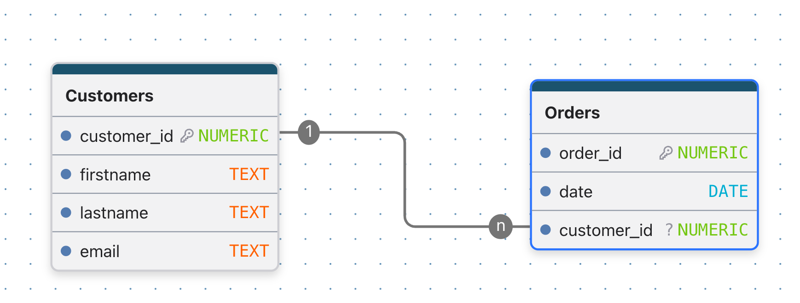
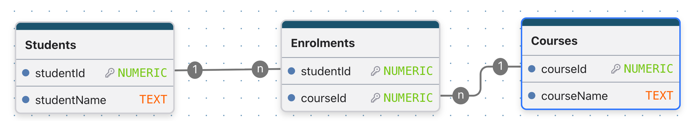

# Introduction to ORM: From JSON to ERD

## What is an ORM?

When we are programming we often represent scenarios as objects.  These objects are created by a definition which is then filled out by data that is downloaded from a data source, commonly a database.

For example, a definition could look like:
**Car**
  - make: text
  - model: text
  - colour: text
  - year_of_manufacture: number;
  - month_of_manufacture: number;

We could fill out the definition above by applying data from a database, for example:

- *Car1* = { make = Toyota, model = Camry, colour = Blue, year_of_manufacture = 2020, month_of_manufacture = 5 }
- *Car2* = { make = Ford, model = Mustang, colour = Red, year_of_manufacture = 2021, month_of_manufacture = 3 }
- *Car3* = { make = Holden, model = Commodore, colour = White, year_of_manufacture = 2019, month_of_manufacture = 11 }

*ORM* is the process of mapping the data from objects to a relational database and vice-versa.  Essentially, creating an ERD from the description and data above.  This is often done automatically by a framework, but it is important to understand how the mapping works.

---

## Why Learn JSON to ERD?

Many modern applications exchange data using **JSON**.

Before storing that data in a relational database, we must:

1. Understand the structure of the JSON.
2. Identify entities.
3. Identify relationships.
4. Design database tables.
5. Create an ERD (Entity Relationship Diagram).

This skill is valuable because real-world APIs often return JSON while business systems often store information in relational databases.

---

## Example 1: Simple Customer Order

## JSON Data

```json
{
  "customerId": 101,
  "firstName": "Sarah",
  "lastName": "Wilson",
  "email": "sarah.wilson@email.com",
  "orders": [
    {
      "orderId": 5001,
      "orderDate": "2025-08-01"
    },
    {
      "orderId": 5002,
      "orderDate": "2025-08-10"
    }
  ]
}
```

## Step 1: Identify Entities

Looking at the JSON, we can see two main things:

- Customer
- Order

??? "*How do we now that Order is an entity?*"
    Because it is an array of objects.  Each object has its own properties.

These become database tables.

## Step 2: Identify Attributes

**Customer**

```text
customerId
firstName
lastName
email
```

**Order**

```text
orderId
orderDate
```

## Step 3: Identify Relationships

A customer can have many orders.

```text
Customer 1 --> Many Orders
```

This is a **one-to-many relationship**.

## ERD

{width=60%}

---

## Example 2: Students and Courses

## JSON Data

```json
"students": [
{
    "studentId": 1001,
    "studentName": "Emma Brown",
    "courses": [
      {
        "courseId": 10,
        "courseName": "Python Programming"
      },
      {
        "courseId": 20,
        "courseName": "Database Design"
      }
    ],
  },
  {
    "studentId": 1002,
    "studentName": "Liam Smith",
    "courses": [
      {
        "courseId": 10,
        "courseName": "Python Programming"
      },
      {
       "courseId": 30,
       "courseName": "Web Development"
      }
    ]
  
  }
]
```

## Identify Entities

```text
Students
Courses
```

## Relationship Analysis

Can a student enrol in many courses?

✅ Yes

Can a course contain many students?

✅ Yes

This is a **many-to-many relationship**.

## ERD

{width=80%}

---

## How to Convert JSON to an ERD

## Step 1: Read the JSON

Look for:

- Objects
- Arrays
- Nested objects

## Step 2: Find Entities

Objects often become tables.

Example:

```json
{
  "customer": {},
  "address": {}
}
```

Potential tables:

```text
Customer
Address
```

## Step 3: Find Attributes

Properties usually become columns.

```json
{
  "firstName": "Sarah",
  "email": "example@gmail.com"
}
```

Becomes:

```text
first_name
email
```

## Step 4: Look for Arrays

Arrays are important.

```json
"orders": [
  {...},
  {...}
]
```

Arrays often indicate:

```text
One-to-Many
```

relationships.

## Step 5: Check for Many-to-Many Relationships

Ask:

> Can both sides have multiple records?

Example:

```json
Student
Courses[]
```

Students can take many courses.

Courses can contain many students.

Result:

```text
Many-to-Many
```

and a junction table is required.

---

## JSON Clues and Their ERD Meaning

| JSON Structure | ERD Interpretation |
|---------------|-------------------|
| Single value | Column |
| Object | Entity/Table |
| Nested Object | Related Entity |
| Array | One-to-Many possibility |
| Array on both sides | Many-to-Many possibility |
| Unique identifier | Primary Key |
| Reference identifier | Foreign Key |

---

## Practice Activity

Convert the following JSON into an ERD.

```json
"orders": [
{
  "orderId": 7001,
  "customer": {
    "customerId": 101,
    "name": "Sarah Wilson"
  },
  "products": [
    {
      "productId": 1,
      "name": "Laptop",
      "price": 1200
    },
    {
      "productId": 2,
      "name": "Mouse",
      "price": 35
    }
  ]
},
{
  "orderId": 7002,
  "customer": {
    "customerId": 102,
    "name": "Ali Mohammed"
  },
  "products": [
   {
    "productId": 2,
    "name": "Mouse" 
   },
   {
     "productId": 3,
     "productName": "Keyboard"
    }
  ]
]
```

## Questions

1. What entities exist?
2. What attributes belong to each entity?
3. Is the relationship one-to-many or many-to-many?
4. Is a junction table required?
5. Draw the ERD.

---

## Key Takeaways

- JSON objects often become database tables.
- JSON properties become columns.
- Arrays frequently indicate relationships.
- Nested objects may become separate entities.
- One-to-many relationships use foreign keys.
- Many-to-many relationships require junction tables.
- ORM tools can automatically map database tables to objects and JSON structures.
- Being able to convert JSON into an ERD is a valuable skill for database design, API development, and modern web applications.
