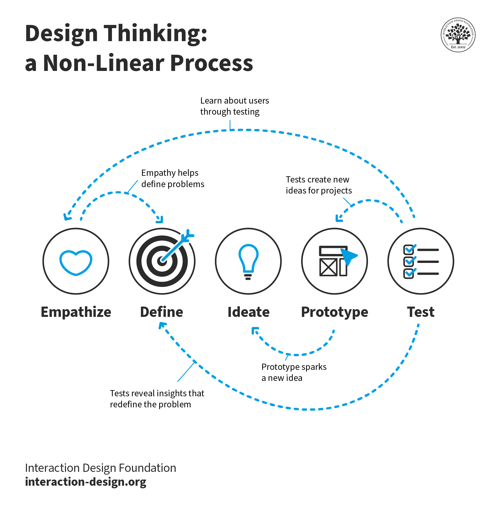
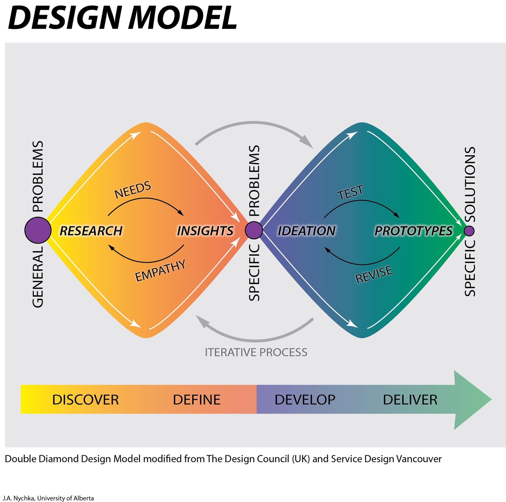
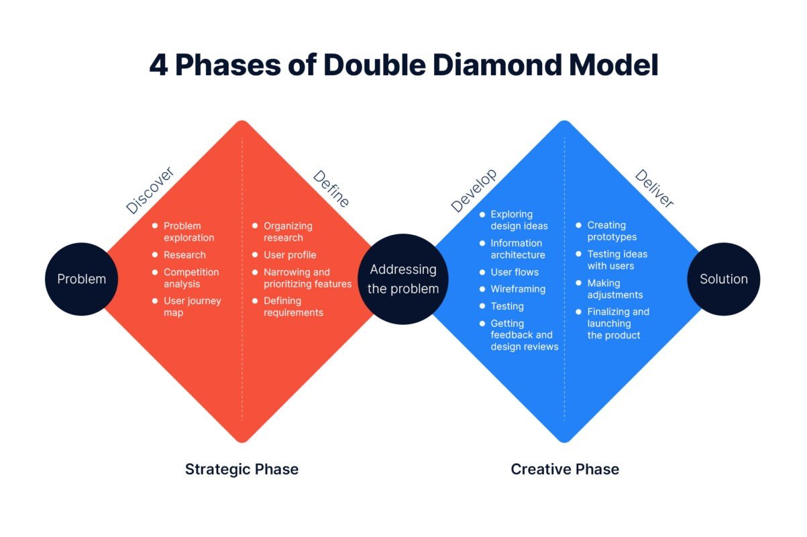

# Design Thinking - Double Diamond

## What is Design Thinking?
**Design thinking** is a **human-centered, iterative approach** to problem-solving that focuses on understanding people’s needs and developing creative, practical solutions. It moves through stages — typically **empathize, define, ideate, prototype, and test** — but these are not always linear. 

Teams often revisit earlier stages as they learn more, refining ideas through feedback and experimentation. This cycle of iteration helps ensure solutions are **innovative, effective, and genuinely meet user needs**.

{ width=600 }

## Why is Design Thinking Useful?
**Design thinking** is useful because it provides an **iterative, human-centered framework** for solving problems creatively and effectively. It emphasizes **empathy** to understand users, **collaboration** to combine diverse perspectives, and **experimentation** to refine ideas through prototyping and testing.

By cycling between exploration and feedback, design thinking reduces risk and leads to **innovative, user-focused** outcomes that evolve as new insights emerge — making it valuable in business, education, and technology alike.

In basic terms design thinking is a concept of practice that encourages the creation of user centric solutions by cycling through the stages used to develop the solution.  This allows a solution to gradually improve rather than just deliver a solution on the first attempt.

## The Double Diamond
To assist with the process of Design Thinking it is useful to use a framework as a guide.  One such framework is the **Double Diamond**.

{ width=600 }

The **Double Diamond** is a design thinking framework that guides teams through the creative process in four stages: **Discover, Define, Develop, and Deliver**. It’s called “double diamond” because it visualizes two phases of divergent and convergent thinking — first to understand the problem, then to create the solution.  

1. In the **Discover** phase, designers explore and research widely to uncover insights.
2. In **Define**, they narrow down to a clear problem statement.
3. The **Develop** phase encourages idea generation and prototyping.
4. **Deliver** focuses on testing and refining the best solutions for real-world implementation.

/// caption
Image c/o [https://artkai.io/blog/double-diamond-design-process](https://artkai.io/blog/double-diamond-design-process) (2025) 
///

## The Discover Phase
The **Discover phase** is the first stage of the Double Diamond and focuses on **exploring and understanding the problem space**. The goal is to gain deep insight into the people affected by the challenge, their needs, and the broader context — rather than jumping straight to solutions.

During this phase, designers **diverge** by gathering as much information as possible through activities like **user interviews, observations, surveys, and research**. It’s about **empathy and curiosity** — uncovering hidden needs, challenges, and opportunities.

Essentially at this phase we are researching as widely as possible to find out what the problem actually is.  Through this research the aim is to gather more insight into the problem.  Often the problem expressed to us is not the problem that requires the solution.

A common tool used in this phase is SWOT analysis. What is SWOT analysis? (class activity):

[Class Activity 1 - Double Diamond - Discover](../tasks/class/class-activity-1-double-diamond-discover.md){ .md-button }

## The Define Phase
The **Define phase** is the second stage of the **Double Diamond** — where teams make sense of everything discovered during research. After gathering lots of information in the **Discover phase**, designers now synthesize and focus it into a clear, actionable problem statement.

This involves identifying **key insights, user needs, and challenges**, then reframing them into a **“How might we…” question** that guides the next stages. The goal is to define the right problem to solve — not just the most obvious one.

The **Define phase** is both **analytical and creative**, often involving iteration as teams revisit research to ensure their problem statement truly captures the user’s core need.

A common tool used in this phase is affinity mapping. [https://www.vic.gov.au/affinity-mapping](https://www.vic.gov.au/affinity-mapping)

At this phase we are narrowing down from the discover phase to try and focus in on determining what the problem we solve will be.  For example, we may start off with the problem of digital literacy in the Discover phase and from our research narrow down to focusing on desktop PC interaction in the Define phase as the problem to solve.

[Class Activity 2 - Double Diamond - Define](../tasks/class/class-activity-2-double-diamond-define.md){ .md-button }