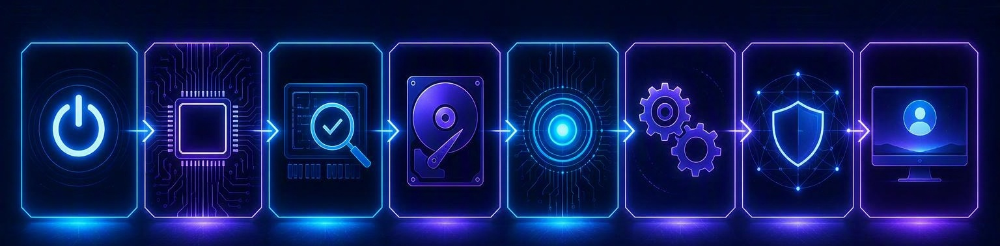

# The Boot Process

When you press the power button on a computer, a precise sequence of events takes place before you see the desktop. This is called the boot process. Understanding what happens during boot helps diagnose startup problems and configure system settings.

---

## Overview of Boot Stages

```text
Power On → BIOS/UEFI → POST → Boot Device → Kernel Loads → Kernel Runs → Services Start → Login/UI
```

Each stage prepares the system for the next. If any stage fails, the computer will not start correctly.



---

## Stage 1: Power On

The moment the power button is pressed, electricity reaches the motherboard and the CPU begins executing its first instructions. Nothing has been checked or loaded yet — this stage simply gets the hardware started.

***

## Stage 2: BIOS / UEFI Firmware

As soon as the CPU starts, control passes to the system firmware. The firmware prepares the basic hardware the computer needs to get going — the keyboard, display, and storage.

### BIOS (Basic Input/Output System)

BIOS is the older firmware standard, used in PCs for decades. It:
- Has a text-based setup interface (press Del/F2 during startup)
- Uses the Master Boot Record (MBR) partitioning scheme
- Supports drives up to 2 TB
- Is limited to 16-bit real mode during boot

### UEFI (Unified Extensible Firmware Interface)

UEFI is the modern replacement for BIOS. It:
- Has a graphical setup interface with mouse support
- Uses the GUID Partition Table (GPT)
- Supports drives larger than 2 TB
- Provides Secure Boot to protect against malware
- Boots faster than legacy BIOS

***

## Stage 3: Power-On Self-Test (POST)

The firmware runs a Power-On Self-Test — a diagnostic routine stored in the firmware that checks whether critical hardware is present and functioning.

POST verifies:
- CPU is working
- RAM is detected and functional
- Storage drives are connected
- Keyboard and basic input devices are present
- Graphics output is available

If POST detects a problem, the computer signals it through:
- **Beep codes** — Patterns of beeps that indicate specific hardware faults (varies by manufacturer)
- **LED indicators** — Some motherboards have diagnostic LEDs
- **Error messages** — Displayed on screen if video is working

A successful POST usually produces a single short beep and the manufacturer's logo appears.

!!! note
    If your computer is beeping and not starting, count the beeps and search the manufacturer's website for the meaning. For example, three long beeps on a Dell may indicate a RAM issue.

***

## Stage 4: Boot Device

Once the POST passes, the firmware looks for a storage device marked as bootable, reads its boot sector (MBR) or EFI System Partition (GPT), and hands control to the boot loader stored there.

The boot loader is a small program that loads the operating system kernel into memory.

### Windows Boot Manager

On Windows systems:
1. The firmware loads **Windows Boot Manager** (`bootmgfw.efi` on UEFI systems)
2. Boot Manager reads the **Boot Configuration Data (BCD)** store
3. If multiple Windows installations exist, it displays a menu to choose one
4. It loads `winload.efi`, which initialises the Windows kernel

### GRUB (Grand Unified Bootloader)

On most Linux systems:
1. The firmware loads **GRUB** from the EFI partition or MBR
2. GRUB displays a menu with available operating systems and kernels
3. After selection (or timeout), GRUB loads the Linux kernel into memory
4. GRUB passes control to the kernel along with boot parameters

***

## Stage 5: Kernel Loads

The boot loader loads the operating system's **kernel** into memory. The kernel is the core of the operating system — the part that manages the hardware and lets every other program run.

***

## Stage 6: Kernel Runs

Once the kernel is in memory, it starts doing its job:

1. It initialises hardware drivers for CPU, memory, storage, and devices
2. It mounts the root file system (the drive partition containing the OS)
3. It starts the first user-space process:
   - On Windows: **Session Manager (`smss.exe`)** which then starts **`winlogon.exe`**
   - On Linux: **`init`** (or `systemd` on modern distributions)
4. From here on, the kernel manages memory, devices, files, and programs on an ongoing basis

***

## Stage 7: Services Start

With the kernel running, essential system services are launched — networking, security, device services, audio, and the display manager.

During this stage, Windows displays the spinning dots and logo; Linux displays scrolling boot messages (unless a splash screen hides them).

***

## Stage 8: Login and User Interface

Once system services are running, the login screen appears:

- **Windows**: `winlogon.exe` presents the lock screen; after authentication, `userinit.exe` starts Explorer (the desktop, taskbar, and Start menu)
- **Linux**: The display manager (GDM, LightDM) presents a graphical login; after login, it starts the desktop environment (GNOME, KDE, etc.)
- **macOS**: `loginwindow` manages user authentication and starts the Finder and Dock

After login, user-specific startup programs run — applications set to launch at login, background services, and system tray items. The desktop is now ready to use.

***

## Important Boot Functions and Features

| Feature | Description |
|---|---|
| **Boot Menu** | Press a key (F12, Esc) during POST to choose which device to boot from |
| **BIOS/UEFI Setup** | Press a key (F2, Del) during POST to configure firmware settings |
| **Boot Order** | The sequence of devices the firmware checks for bootable media |
| **Secure Boot** | UEFI feature that only allows signed boot loaders to run |
| **Fast Startup** | Windows feature that hibernates the kernel instead of shutting down fully |
| **Safe Mode** | Boots Windows or macOS with minimal drivers for troubleshooting |
| **Recovery Mode** | Linux option that boots into a minimal environment for repairs |

***

## Troubleshooting Boot Issues

| Symptom | Possible Cause | Check |
|---|---|---|
| No power, no lights | Power supply, outlet, or cable | Try a different outlet and cable |
| Fans spin, no display | RAM, GPU, or display cable | Reseat RAM and GPU, check monitor input |
| Beep codes on startup | Hardware failure | Look up beep codes for your motherboard |
| "Boot device not found" | Storage drive disconnected or failed, boot order wrong | Check BIOS/UEFI boot order and drive connections |
| "Operating system not found" | Boot loader missing or corrupted | Use installation media to repair boot loader |
| Boots to wrong OS | Incorrect boot order | Change boot order in BIOS/UEFI |

---

## Summary

- The boot process has eight stages: power on, firmware, POST, boot device, kernel loads, kernel runs, services start, and login
- The firmware prepares basic hardware and the POST checks that essential components are working
- BIOS is the older firmware standard; UEFI is the modern replacement with more features
- The boot device stage starts the boot loader (Windows Boot Manager or GRUB), which then loads the kernel
- Once the kernel runs, services start and the login screen appears
- Understanding the boot process helps diagnose startup problems
