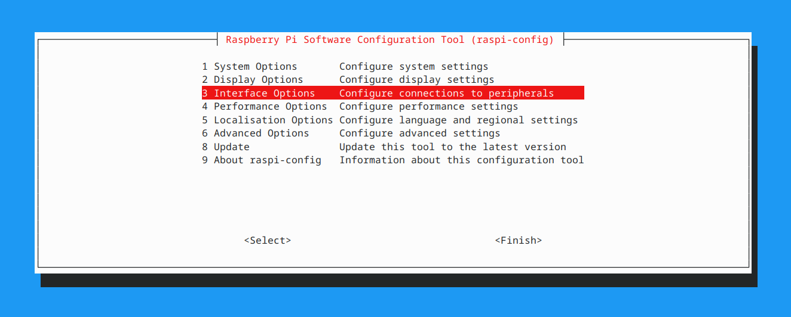
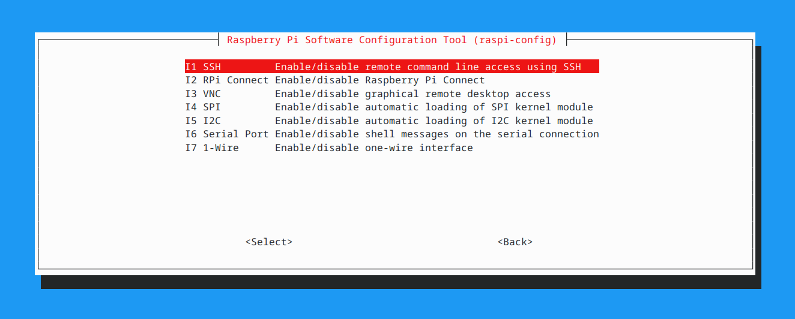
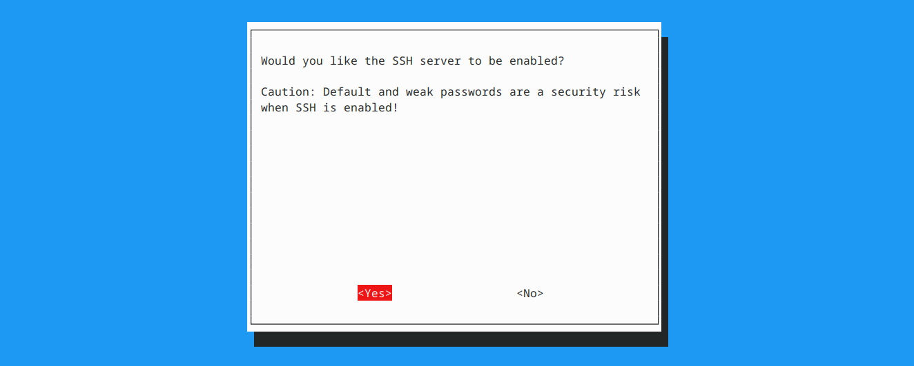

# Enabling SSH

If you wrote your Raspberry Pi OS image without enabling SSH in the Imager settings, you do not need to re-flash the card. You can enable SSH using the built-in configuration tool on the Pi.

---

## Using raspi-config

If you have a monitor and keyboard connected to the Pi (or can temporarily connect them), you can enable SSH from the terminal.

### Steps

1. **Log in** to the Pi with your keyboard and monitor

2. **Run the configuration tool**:
    ```bash
    sudo raspi-config
    ```

3. **Navigate to Interface Options** using the arrow keys and press Enter

    

4. **Select SSH** and press Enter

    

5. **Select Yes** when asked if you want to enable the SSH server

    

6. **Select Finish** to exit the tool

7. If prompted, choose **Yes** to reboot, or reboot manually:
    ```bash
    sudo reboot
    ```

8. After the Pi restarts, SSH will be enabled. Find the Pi's IP address by checking your router's admin page or running `ifconfig`, then connect remotely:
    ```bash
    ssh <username>@<ip-address>
    ```

---

## Verifying SSH Is Running

You can check SSH status directly on the Pi:

```bash
systemctl status ssh
```

This will show whether the SSH service is active and running.

---

## Summary

- You do not need to re-image the SD card to enable SSH
- Run `sudo raspi-config`, go to Interface Options, and enable SSH
- Reboot the Pi for the change to take effect
- After enabling SSH, find the Pi's IP address and connect remotely with `ssh <username>@<ip-address>`
