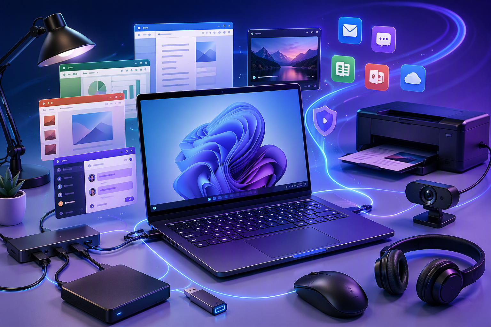

# Hardware, Software, and Operating Systems

A computer system is built from three layers that work together: hardware at the bottom, the operating system in the middle, and application software on top. Understanding how these layers interact is essential for configuring, troubleshooting, and supporting computer systems.

---

## The Software Stack

```text
┌─────────────────────────────┐
│     Application Software    │  ← Word, Chrome, Spotify
├─────────────────────────────┤
│     Operating System        │  ← Windows, macOS, Linux
├─────────────────────────────┤
│     Hardware                │  ← CPU, RAM, storage, peripherals
└─────────────────────────────┘
```

Each layer depends on the layer below it:

- **Applications** do not talk to hardware directly. They ask the OS to perform tasks.
- The **operating system** translates those requests into instructions the hardware can understand.
- The **hardware** executes the instructions — reading from disk, displaying to screen, sending data over the network.

This layered design means application developers do not need to write code for every possible hardware combination. They write for the OS, and the OS handles the hardware.

***

## System Software vs Application Software

Software falls into two broad categories:

### System Software

System software manages and controls the computer hardware so that application software can function. It includes:

- **Operating systems** — Windows, macOS, Linux
- **Device drivers** — Software that lets the OS communicate with specific hardware
- **Firmware** — Low-level software stored on hardware (BIOS/UEFI)
- **Utility software** — Disk management, antivirus, backup tools

### Application Software

Application software helps users perform specific tasks. It includes:

- **Productivity** — Microsoft Word, Excel, Google Docs
- **Communication** — Outlook, Teams, Slack, Zoom
- **Web browsers** — Chrome, Edge, Firefox
- **Creative tools** — Photoshop, Premiere Pro, Blender
- **Development tools** — VS Code, Git, Docker

Application software is what most users interact with day-to-day. It relies on the system software underneath to actually get things done.



***

## How the OS Bridges Hardware and Software

When you save a file in a word processor, this is what happens:

1. You press **Ctrl+S** — the application receives the keyboard event from the OS
2. The application calls an OS function to write data to disk
3. The OS's **file system driver** determines where on the disk to store the data
4. The OS's **storage driver** sends the write command to the disk controller
5. The **hardware** writes the data to the physical storage medium

At no point does the word processor need to know whether the file is being saved to an SSD, an HDD, or a network drive. The OS abstracts that complexity away.

***

## Compatibility Between Components

Not every combination of hardware, OS, and software will work together. Compatibility must be checked at each boundary.

### Hardware ↔ OS Compatibility

Before installing an operating system, verify:

- The CPU architecture is supported (x86-64 for Windows, Apple Silicon or Intel for macOS)
- Sufficient RAM and storage are available (check minimum requirements)
- Drivers exist for critical components (graphics, network, storage)

### OS ↔ Application Compatibility

Before installing software, check:

- The application version supports your OS version
- 32-bit vs 64-bit architecture (most modern systems are 64-bit)
- Any additional dependencies or frameworks are installed (.NET, Java, etc.)

### Hardware ↔ Peripheral Compatibility

When adding external devices:

- Ensure the computer has the correct port type (USB-A, USB-C, HDMI)
- Check that drivers are available for your operating system
- Verify power requirements (some devices need external power)

***

## Organisational Requirements and Specifications

In a workplace setting, IT decisions are guided by organisational requirements. These are documented guidelines that define what hardware and software are approved for use. Common considerations include:

| Requirement | Example |
|---|---|
| **Compatibility** | All staff computers must run Windows 11 to ensure compatibility with corporate software |
| **Performance** | Workstations must have at least 16 GB RAM and a 512 GB SSD |
| **Security** | Only approved, vendor-supported software may be installed |
| **Budget** | Hardware must fall within per-unit budget limits |
| **Supportability** | IT support staff must be trained on the chosen technology |
| **Licensing** | All software must have valid, documented licences |

Following organisational specifications ensures that systems are consistent, supportable, and secure across the entire organisation.

---

## Summary

- Computers operate as a three-layer stack: hardware → OS → applications
- The OS abstracts hardware complexity so applications can work across different hardware
- System software (OS, drivers, firmware) manages the computer; application software performs user tasks
- Compatibility must be checked at each layer boundary
- Organisational requirements guide hardware and software choices in professional environments
