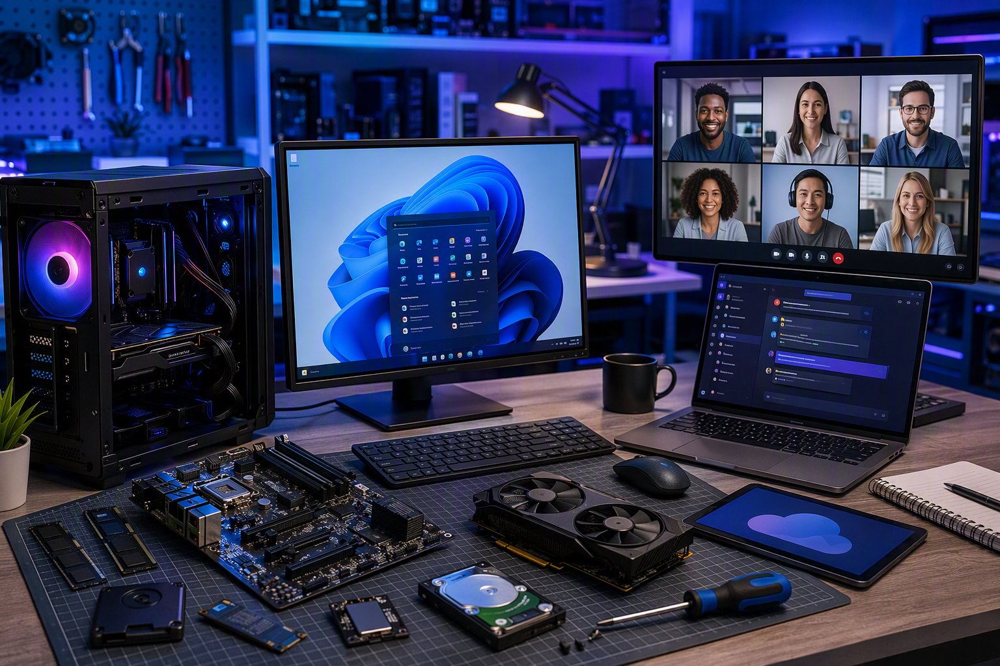
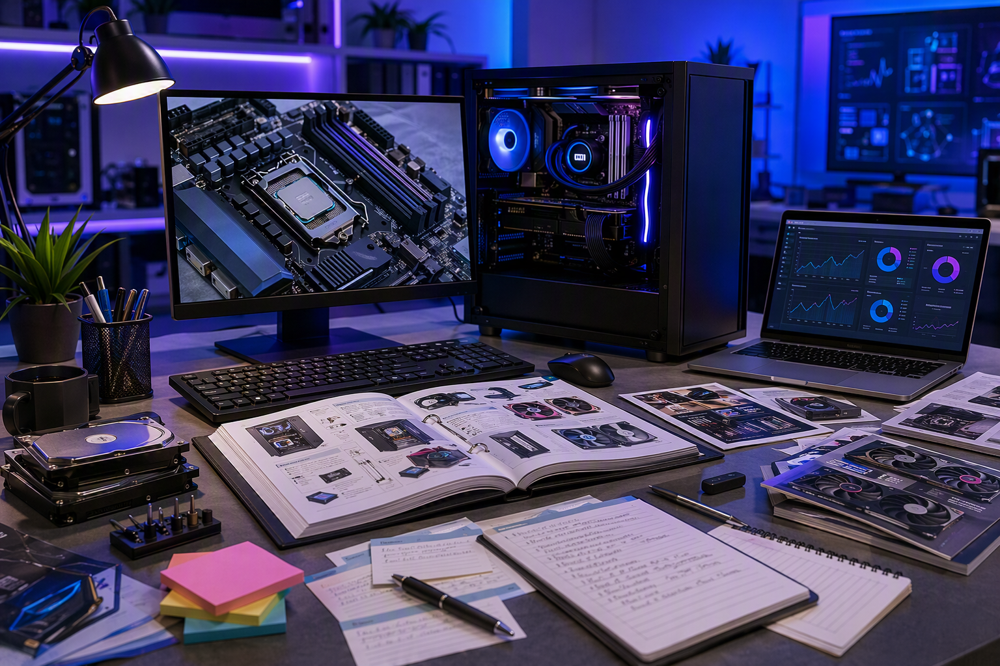

# Identifying Industry Technologies

The ICT industry evolves rapidly. New hardware, software, and standards emerge constantly. The ability to identify, research, and classify technologies is a valuable skill that helps organisations stay competitive, secure, and efficient.

---

## ICT Industry Overview

The Information and Communications Technology industry encompasses:

- **Hardware** — Computers, servers, networking equipment, mobile devices, IoT
- **Software** — Operating systems, applications, cloud services, development tools
- **Services** — IT support, consulting, managed services, cybersecurity, training
- **Infrastructure** — Data centres, fibre networks, wireless towers, satellite systems

Technology choices made by an organisation directly affect its productivity, security, costs, and ability to compete. Making informed decisions requires systematic research and evaluation.

***

## Current Technology Trends

Staying current with industry trends helps organisations identify opportunities and risks. Here are significant areas of development:

| Trend | Description |
|---|---|
| **Cloud Computing** | Running applications and storing data on remote servers (AWS, Azure, Google Cloud) instead of on-premises hardware |
| **Artificial Intelligence** | Machine learning, generative AI, and automation transforming how work gets done |
| **Cybersecurity** | Growing threats driving demand for zero-trust architectures, multi-factor authentication, and endpoint protection |
| **Internet of Things (IoT)** | Networked sensors and devices in manufacturing, logistics, healthcare, and smart buildings |
| **Edge Computing** | Processing data near where it is generated rather than sending it to a central data centre |
| **5G and Connectivity** | Faster wireless networks enabling new mobile and remote work capabilities |
| **Sustainability** | Energy-efficient hardware, e-waste reduction, and green data centres |

***

## Major Industry Standards

Standards ensure that products from different vendors can work together. Key ICT standards include:

| Standard | Domain | Purpose |
|---|---|---|
| **IEEE 802.3** | Ethernet | Defines wired networking |
| **IEEE 802.11** | Wi-Fi | Defines wireless networking (Wi-Fi 6, Wi-Fi 7) |
| **USB (Universal Serial Bus)** | Connectivity | Standardised connection for peripherals |
| **HDMI / DisplayPort** | Video | Standardised display connections |
| **HTML / CSS / JavaScript** | Web | Core web technologies maintained by W3C and WHATWG |
| **SQL** | Databases | Standard language for querying relational databases |
| **TCP/IP** | Networking | The fundamental protocol suite of the internet |
| **ISO 27001** | Security | International standard for information security management |

Organisations prefer standards-based solutions because they avoid vendor lock-in, ensure interoperability, and have broad industry support.

***

## Vendor Product Directions

Major technology vendors publish roadmaps showing where their products are heading. Understanding vendor direction helps organisations plan upgrades and avoid investing in technology that may be discontinued.

| Vendor | Key Product Areas |
|---|---|
| **Microsoft** | Windows, Microsoft 365, Azure cloud, AI (Copilot), GitHub |
| **Apple** | macOS, iOS, Apple Silicon, iCloud, services ecosystem |
| **Google** | Android, Chrome OS, Google Cloud, Workspace, AI (Gemini) |
| **Amazon (AWS)** | Cloud infrastructure, serverless computing, AI/ML services |
| **Dell / HP / Lenovo** | Enterprise and consumer hardware, support services |
| **Cisco** | Networking hardware, security, collaboration tools |
| **CrowdStrike / Palo Alto** | Cybersecurity platforms |

Sources for vendor direction information:
- Vendor official websites and blogs
- Industry conferences and keynote presentations
- Technology news outlets (Ars Technica, The Verge, ZDNet)
- IT analyst reports (Gartner, IDC, Forrester)

***

## Researching Technologies

When an organisation needs to evaluate a new technology, a structured research approach produces better results than ad-hoc Googling.

### Step 1: Define the Requirement

What problem needs to be solved? Be specific:
- "We need a video conferencing platform for 50 staff" (not just "we need better communication")
- "We need a backup solution that meets our 4-hour recovery target" (not just "better backup")

### Step 2: Identify Candidate Technologies

- Search industry publications and technology comparison sites
- Ask peers in similar organisations what they use
- Check vendor websites for products in the category
- Use review platforms (G2, Capterra, TrustRadius) for user feedback

### Step 3: Compare Against Criteria

Create a comparison matrix. Score each option against your requirements.

| Criteria | Technology A | Technology B | Technology C |
|---|---|---|---|
| Meets functional requirements | Yes | Yes | Partial |
| Within budget | Yes | No | Yes |
| Compatible with existing systems | Yes | Yes | Yes |
| Vendor support available | 24/7 | Business hours | Community only |
| Training resources available | Extensive | Limited | Good |

### Step 4: Test Before Committing

- Trial versions, free tiers, or proof-of-concept deployments
- Involve the people who will actually use the technology
- Test with realistic workloads, not just demos

***

## Classifying Technologies

Organisations classify technologies to help with planning, budgeting, and support:

| Classification | Description | Example |
|---|---|---|
| **Strategic** | Critical to the organisation's future success | Customer relationship management system |
| **Operational** | Required for day-to-day operations | Email, file sharing, payroll |
| **Emerging** | New, not yet widely adopted; may become strategic | Blockchain, quantum computing |
| **Legacy** | Older technology still in use, possibly unsupported | Windows 7, COBOL applications |
| **Commodity** | Widely available, interchangeable | Keyboards, monitors, basic printers |

Classifications guide decisions: strategic technologies justify investment; legacy technologies need a migration plan; commodity items should be chosen based on price and reliability.

***

## Organisational Requirements

Organisational requirements shape technology decisions. Common factors include:

| Requirement | Impact on Technology Choice |
|---|---|
| **Budget** | Sets the upper limit; open source may be preferred over paid licences |
| **Security policy** | May require specific encryption, authentication, or data residency |
| **Compliance** | Industry regulations may mandate certain technologies or restrict others |
| **Existing infrastructure** | New technology must integrate with what is already in place |
| **Staff skills** | The organisation must be able to support and use the technology |
| **Growth plans** | Technology should scale as the organisation grows |

Identifying a genuine business need is the starting point for any technology upgrade:

---

## Summary

- The ICT industry spans hardware, software, services, and infrastructure
- Current trends include cloud computing, AI, cybersecurity, IoT, and sustainability
- Industry standards (IEEE, USB, TCP/IP) ensure products from different vendors work together
- Track vendor roadmaps to avoid investing in technology being phased out
- Use a structured research process: define requirements, identify candidates, compare, test
- Classify technologies as strategic, operational, emerging, legacy, or commodity
- Organisational requirements — budget, security, compliance, staff skills — guide all technology decisions
