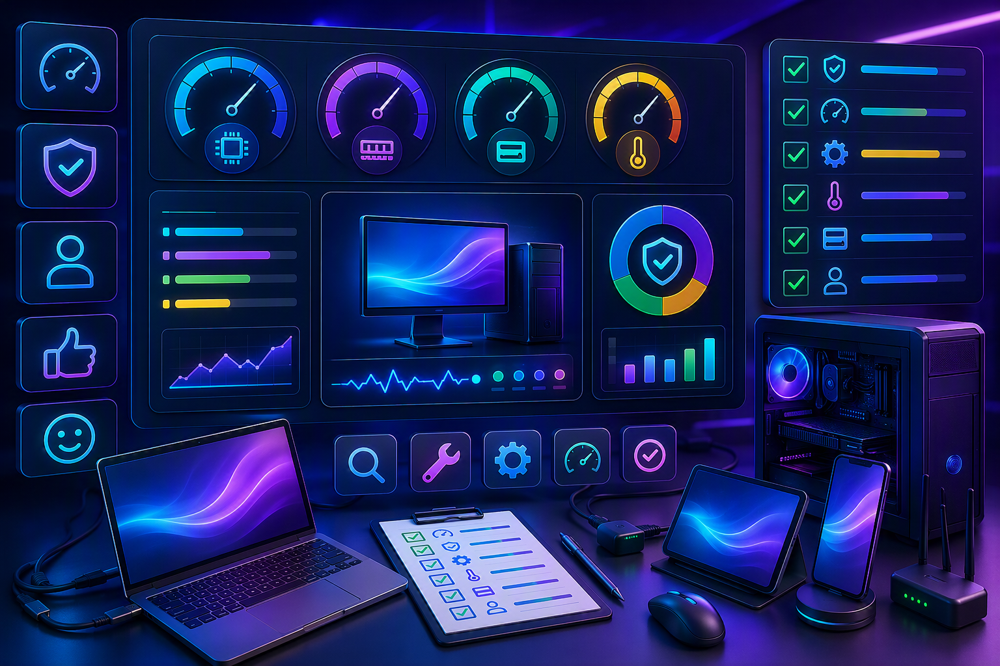
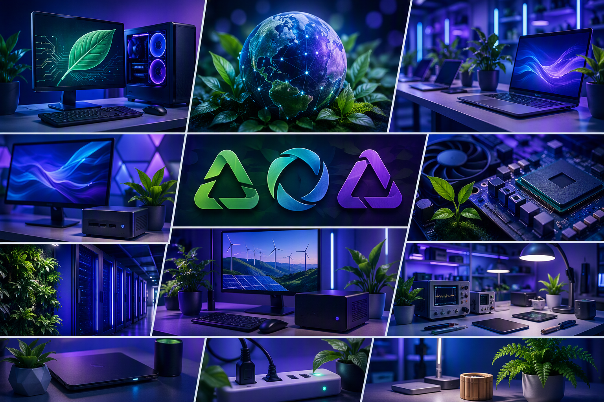
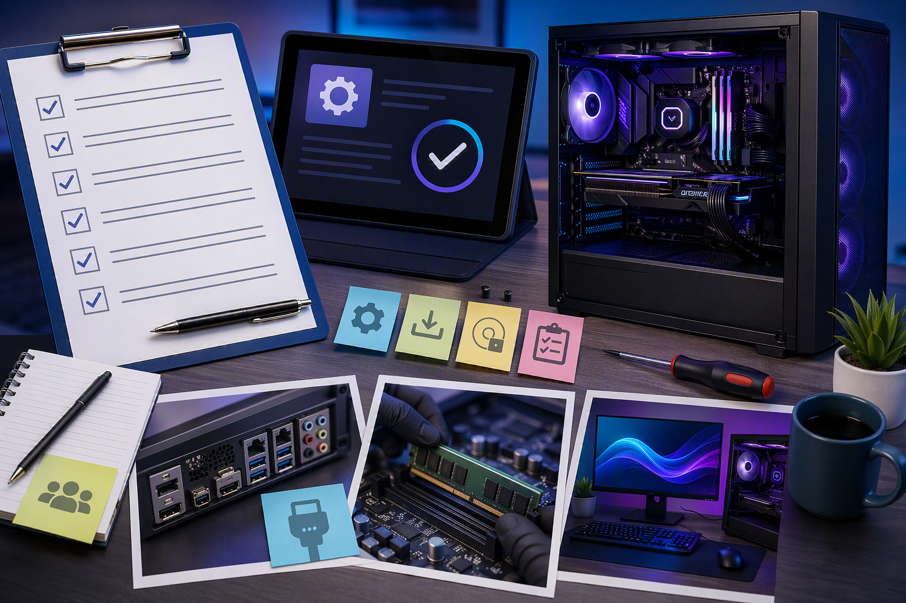

# Implementing and Evaluating Technology

Once an organisation has identified a new technology to adopt, the next stage is implementation and evaluation. This involves deploying the technology in a controlled way, testing that it works as expected, assessing its value, and gathering feedback from users.

---

## Implementing New Technology

Implementation is the process of making a new technology operational within an organisation. A careful, planned approach reduces risk and disruption.

### Step 1: Plan the Implementation

Before touching any systems, document the plan:

- **Scope** — Which users, departments, or locations are affected?
- **Timeline** — When will it happen? Allow time for testing and rollback.
- **Dependencies** — What other systems or data does the new technology rely on?
- **Rollback plan** — How do you undo the change if something goes wrong?
- **Success criteria** — How will you know the implementation worked?

### Step 2: Prepare the Environment

- Verify hardware meets the technology's requirements
- Ensure the OS and supporting software are up to date
- Back up existing data and configuration
- Inform users about the change and expected downtime

### Step 3: Install and Configure

- Install the technology following vendor instructions
- Apply the organisation's standard configuration
- Set up user accounts, permissions, and access controls
- Configure integration with existing systems (single sign-on, data imports)

### Step 4: Test

Test before releasing to all users:

| Test Type | What to Check |
|---|---|
| **Functional** | Do the features work as expected? |
| **Integration** | Does it work with existing systems? |
| **Performance** | Is it responsive under normal and peak loads? |
| **Security** | Are permissions correct? Is data protected? |
| **User acceptance** | Can a typical user complete their tasks? |

Start with a small pilot group before rolling out to the entire organisation.

***

## Using Features and Functions

Organisations rarely use every feature of a technology. The goal is to use the features that provide value for the task at hand.

### Identifying Relevant Features

1. Read the vendor's documentation and feature list
2. Map features to the organisation's requirements
3. Prioritise: which features address the most important needs?
4. Train users on the features they actually need — avoid overwhelming new users with everything at once

### Example: Microsoft Teams

Microsoft Teams has hundreds of features, but a small organisation might only need:

| Feature | Purpose |
|---|---|
| **Chat** | One-on-one and group text messaging |
| **Video calls** | Face-to-face meetings with screen sharing |
| **Teams and channels** | Organised conversation spaces by topic or department |
| **File sharing** | Share documents within a team channel |

Other features (Power Automate integrations, advanced telephony, webinar hosting) can be adopted later as needs grow.

***

## Accessing and Using Information Sources

During implementation and ongoing use, you will need to reference information sources.

| Source | Best For |
|---|---|
| **Vendor documentation** | Installation guides, feature descriptions, API references |
| **Knowledge base articles** | Specific how-to questions and troubleshooting steps |
| **Community forums** | Real-world solutions from other users (Stack Overflow, Reddit, vendor forums) |
| **Training materials** | Structured learning for new users |
| **Internal documentation** | Organisation-specific procedures and configurations |
| **Vendor support** | Assistance with bugs, licencing, and critical issues |

---

## Evaluating Technology Performance

After the technology has been in use for a period, evaluate whether it has delivered the expected benefits.

### Performance Criteria

| Criteria | Questions to Ask |
|---|---|
| **Functionality** | Does it do what we needed it to do? Are there gaps? |
| **Usability** | Can users complete tasks efficiently? Is training adequate? |
| **Reliability** | How often does it fail or need support intervention? |
| **Performance** | Is it fast enough? Does it slow down under load? |
| **Cost** | Has the total cost (licences, training, support) matched the budget? |
| **Benefit** | Has productivity, quality, or another metric improved? |

### Data Sources for Evaluation

- **User feedback** — Surveys, interviews, support ticket analysis
- **System metrics** — Uptime reports, response times, error logs
- **Business metrics** — Time saved, costs reduced, output increased

---

## Environmental Considerations

Technology has an environmental impact throughout its lifecycle. Organisations should consider:

| Lifecycle Stage | Consideration |
|---|---|
| **Manufacturing** | Raw material extraction, energy used in production, hazardous substances |
| **Packaging and shipping** | Plastic waste, transport emissions |
| **Usage** | Power consumption, cooling requirements, paper and consumable usage |
| **End of life** | E-waste, recycling programs, secure data destruction |

### Reducing Environmental Impact

- Choose energy-efficient hardware (look for ENERGY STAR certification)
- Enable power-saving settings on all computers (sleep after inactivity)
- Recycle e-waste through certified recyclers (not general waste)
- Use cloud services that run on renewable energy where possible
- Extend hardware lifespan through upgrades rather than full replacements
- Print only when necessary; use duplex (double-sided) printing by default

---

## Seeking and Responding to Feedback

Feedback from users and stakeholders is essential for continuous improvement.

### Gathering Feedback

- **Surveys** — Short, focused questionnaires after rollout
- **Interviews** — One-on-one conversations with key users
- **Support ticket analysis** — What are people asking for help with?
- **Usage analytics** — Which features are being used? Which are ignored?

### Responding to Feedback

Take feedback seriously — it tells you whether the technology is working and what needs to change.

1. **Acknowledge** — Let people know their feedback was received
2. **Analyse** — Look for patterns; is it one person or many with the same issue?
3. **Act** — Fix problems, provide additional training, or adjust configuration
4. **Communicate** — Tell people what changed and why

### Documentation

Record the evaluation results and feedback for future reference. This helps when:
- Renewing licences (is it worth keeping?)
- Planning upgrades (what needs to improve?)
- Selecting future technologies (what lesson was learned?)

A simple evaluation document should include:
- Technology name and version
- Date of implementation and evaluation period
- Summary of user feedback
- Performance against success criteria
- Recommendations (keep, replace, upgrade, expand)

---

## Summary

- Implementation should be planned with clear scope, timeline, and rollback strategy
- Test thoroughly — functionality, integration, performance, security, and user acceptance
- Use only the features that provide value; train users on what they actually need
- Reference vendor documentation, community forums, and internal procedures for support
- Evaluate technology against objective criteria: functionality, usability, reliability, cost, and benefit
- Consider environmental impact at every lifecycle stage — from manufacturing to disposal
- Gather and act on user feedback to continuously improve
- Document evaluation results for future decision-making
