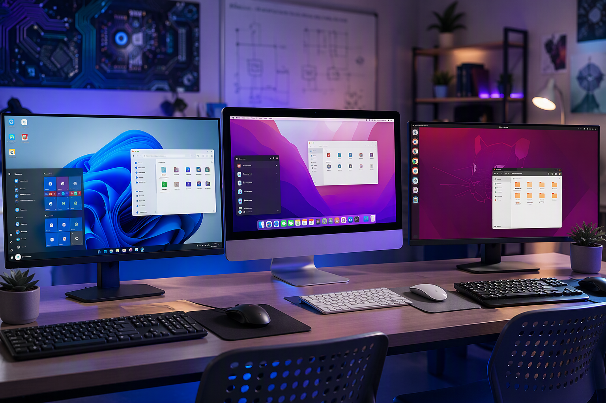

# Introduction to Operating Systems

An operating system (OS) is the most important piece of software on any computer. It manages all of the computer's hardware and software resources, and provides a platform for applications to run on. Without an operating system, a computer cannot function.

---

## What Does an Operating System Do?

Every operating system performs several core functions:

| Function | Description |
|---|---|
| **Resource Management** | Allocates CPU time, memory, and storage to running programs |
| **File Management** | Organises, stores, and retrieves files on storage devices |
| **User Interface** | Provides a way for users to interact with the computer (GUI or CLI) |
| **Security** | Controls user access, permissions, and protects against threats |
| **Process Management** | Handles multiple running programs simultaneously |
| **Device Management** | Communicates with hardware through device drivers |

***

## Types of Operating Systems

There are many operating systems in use today, but three dominate the personal computer market:

### Microsoft Windows

Windows is the most widely used desktop operating system in business and education environments. It is known for broad hardware and software compatibility, and is pre-installed on most new PCs from major manufacturers.

{ width="110" }

**Key features:**
- Familiar Start menu and taskbar interface
- Extensive software library (Microsoft Office, Adobe Creative Suite, games)
- Active Directory integration for enterprise environments
- Regular updates through Windows Update

### macOS

macOS is Apple's operating system, designed exclusively for Mac computers. It is known for its clean design, tight integration with other Apple devices, and strong multimedia capabilities.

{ width="110" }

**Key features:**
- Unified design language and gesture-based navigation
- Built-in productivity apps (Pages, Numbers, Keynote)
- Seamless integration with iPhone, iPad, and Apple Watch
- Unix-based foundation with a powerful Terminal

### Linux

Linux is a free and open-source operating system available in many different distributions (distros) such as Ubuntu, Fedora, and Debian. It powers everything from web servers and supercomputers to Android phones.

{ width="110" }

**Key features:**
- Free to download, use, and modify
- Highly customisable through different desktop environments
- Excellent for programming and server administration
- Strong security model with user permissions

***

## Comparing Operating Systems

| Feature | Windows | macOS | Linux |
|---|---|---|---|
| Cost | Paid license (~$200 AUD) | Free with Apple hardware | Free |
| Hardware | Most PCs | Apple only | Most PCs |
| Software library | Largest | Strong creative tools | Growing; mostly open-source |
| Customisation | Moderate | Limited | Extensive |
| Gaming | Best support | Growing | Limited |
| Security | Frequent target | Strong reputation | Very strong |
| Command line | PowerShell / CMD | Terminal (zsh/bash) | Terminal (bash) |

***

## Mobile Operating Systems

Mobile devices use their own operating systems:

- **Android** — Google's Linux-based OS, used by Samsung, Google Pixel, Oppo, and many other manufacturers
- **iOS** — Apple's mobile OS, used exclusively on iPhones
- **iPadOS** — A variant of iOS designed specifically for iPad's larger screen

***

## Choosing an Operating System

The right operating system depends on what you need to do:

- **General office work and business?** Windows is the most common choice in Australian workplaces.
- **Design, video editing, or music production?** macOS is widely used in creative industries.
- **Programming, servers, or learning how computers work?** Linux gives you full control and is valued in IT careers.
- **Specific software requirements?** Choose the OS that runs the software you need.

Many IT professionals work with multiple operating systems — running Windows on their desktop, using Linux servers, and testing on macOS. Understanding the strengths and differences of each is a fundamental IT skill.

---

## Summary

- An operating system manages hardware, software, files, and security
- The three major desktop OSes are Windows, macOS, and Linux
- Each OS has different strengths, costs, and software ecosystems
- Choosing an OS depends on the task, the available hardware, and organisational requirements
- IT professionals should be familiar with multiple operating systems
