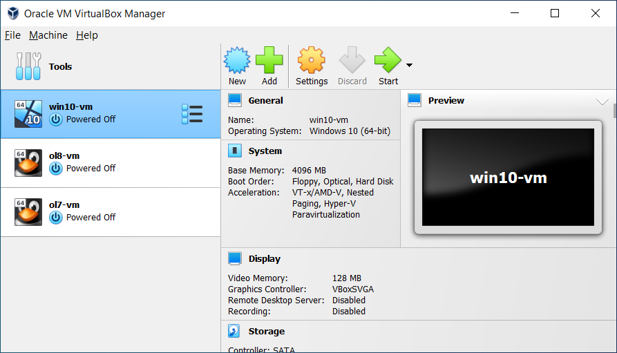

# Introduction to Virtual Machines

A **virtual machine (VM)** is a software-based computer that runs inside your real computer. Instead of installing an operating system directly onto physical hardware, a program called a **hypervisor** creates an isolated environment with virtual hardware — CPU, memory, storage, and network — that a guest operating system can use as if it were a real machine.

This page introduces the concepts behind virtual machines and the **Oracle VM VirtualBox** application. The companion page, [Installing an OS in VirtualBox](virtualbox-installing-os.md), walks through the steps for creating a VM and installing an operating system inside it.

---

## Why is Virtualization Useful?

VirtualBox provides several techniques and features that are useful in the following scenarios:

- **Running multiple operating systems simultaneously.** VirtualBox lets you run more than one OS at a time. You can run software written for one OS on another — for example, Windows software on Linux or a Mac — without rebooting. Because you control what virtual hardware is presented to each guest, you can even install old operating systems such as DOS or OS/2 on modern hardware that no longer supports them natively.

- **Easier software installations.** Software vendors can ship an entire configuration as a virtual machine, often called an **appliance**. Instead of installing and configuring a complex service (such as a mail server) by hand, you can simply import an appliance into VirtualBox.

- **Testing and disaster recovery.** A VM and its virtual hard disks can be treated as a container that can be frozen, copied, backed up, and moved between hosts. Using **snapshots**, you can save the state of a VM and revert to it later, which makes it safe to experiment — if something goes wrong, you can switch back to a previous snapshot instead of doing a full restore.

- **Infrastructure consolidation.** Virtualization can significantly reduce hardware and electricity costs. Many physical computers only use a fraction of their potential power. Instead of running many underused machines, you can pack many virtual machines onto a few powerful hosts and balance the load between them.

***

## Key Terminology

When working with virtualization, it helps to understand a few important terms:

| Term | Meaning |
|---|---|
| **Host operating system (host OS)** | The OS of the physical computer on which VirtualBox is installed. Versions exist for Windows, macOS, Linux, and Oracle Solaris. |
| **Guest operating system (guest OS)** | The OS running *inside* the virtual machine. VirtualBox can run many x86 OSes such as DOS, Windows, OS/2, FreeBSD, and OpenBSD. |
| **Virtual machine (VM)** | The special environment VirtualBox creates for your guest OS. Normally a VM is shown as a window on your desktop. Internally, a VM is a set of parameters describing its hardware and state. |
| **Guest Additions** | Software packages installed *inside* the guest OS to improve performance and add features such as shared folders, seamless windows, and better mouse and display integration. |

***

## Features Overview

VirtualBox is a **hosted hypervisor**, sometimes called a **type 2 hypervisor**. Unlike a *bare-metal* (type 1) hypervisor, which runs directly on the hardware, VirtualBox requires an existing operating system and runs alongside your normal applications.

Key features include:

- **Portability.** VirtualBox runs on many 64-bit host operating systems and behaves almost identically on all of them. The same file and image formats are used, so a VM created on Windows can be run on Linux. Virtual machines can also be imported and exported using the industry-standard **Open Virtualization Format (OVF)**.

- **Guest Additions and shared folders.** After installing the Guest Additions inside a guest, the VM supports automatic video-resizing, seamless windows, and accelerated 3D graphics. Guest Additions also provide **shared folders**, which let you access files on the host system from inside the guest.

- **Comprehensive hardware support.** VirtualBox can present up to 32 virtual CPUs to each VM, regardless of the physical cores on your host. It supports USB devices, a wide range of virtual disk controllers (IDE, SCSI, SATA), virtual network and sound cards, and full ACPI support.

- **Multigeneration branched snapshots.** You can save snapshots of a VM's state at any time and revert to them later, creating a tree of possible configurations.

- **VM groups.** Virtual machines can be organised into groups — and a VM can belong to more than one group — making it easier to start, pause, and manage several machines together.

***

## Supported Host Operating Systems

VirtualBox currently runs on the following 64-bit host operating systems:

| Platform | Supported Versions |
|---|---|
| **Windows** | Windows 8.1, Windows 10, Windows 11, Windows Server 2012 through 2022 |
| **macOS** | macOS 10.15 (Catalina), 11 (Big Sur), 12 (Monterey) — Intel hardware required. A Developer Preview installer is available for Apple silicon. |
| **Linux** | Ubuntu, Debian, Oracle Linux, CentOS/RHEL, Fedora, Gentoo, SUSE, and openSUSE — plus most systems based on kernel 2.6, 3.x, 4.x, or 5.x |
| **Oracle Solaris** | Oracle Solaris 11.4 (64-bit only) |

!!! note "Host CPU requirement"
    Host CPUs must support **SSE2** (Streaming SIMD Extensions 2).

***

## Installing VirtualBox

VirtualBox is split into two components:

- **Base package.** All of the open-source components, licensed under the GNU General Public License (GPL) V3. This is the main download.
- **Extension packs.** Optional add-ons that extend the base package. Oracle provides a single extension pack that adds features such as VirtualBox Remote Desktop Protocol (VRDP) support, host webcam passthrough, Intel PXE boot ROM, AES disk-image encryption, and cloud integration features.

!!! note
    The base package is sufficient for creating a VM and installing an operating system. The extension pack is only needed for the extra features listed above.

To install VirtualBox:

1. Download the installer for your host OS from [virtualbox.org](https://www.virtualbox.org)
2. Run the installer and follow the on-screen prompts
3. (Optional) Install the **Extension Pack** by double-clicking its `.vbox-extpack` file, or from the **Extensions** tool in VirtualBox Manager

***

## Starting VirtualBox

After installation, start VirtualBox as follows:

- **Windows:** Open the **Programs** menu and click the item in the **VirtualBox** group, or type `VirtualBox` in the Start menu search box.
- **macOS:** In the **Finder**, double-click **VirtualBox** in the **Applications** folder.
- **Linux / Oracle Solaris:** Look in the **System** or **System Tools** group of your applications menu, or run `VirtualBox` from a terminal.

When VirtualBox starts, the **VirtualBox Manager** window is shown.

***

## VirtualBox Manager

VirtualBox Manager is the main user interface for creating, configuring, and managing virtual machines.

<small class="img-credit">Image source: <a href="https://www.virtualbox.org/manual/ch01.html" target="_blank" rel="noopener">Oracle VM VirtualBox Manual — Chapter 1</a></small>

The main components of the window are:

- **The machine list.** The left pane lists all of your virtual machines. If you have not created any yet, the list is empty.

- **The Details pane.** The pane on the right shows the properties of the selected virtual machine, along with a toolbar of buttons:
    - **New** — creates a new virtual machine
    - **Add** — adds an existing virtual machine to the list
    - **Settings** — opens the Settings window for the selected VM
    - **Discard** — for a running VM, discards its saved state and closes it
    - **Show / Start** — displays the window of a running VM, or starts a stopped VM

- **Help Viewer.** Displays context-sensitive help for VirtualBox Manager tasks. Press **F1** or click **Help** in any wizard or dialog.

### Global Tools and Machine Tools

VirtualBox Manager provides two types of tools for common tasks:

- **Global Tools** (available from the menu icon in the **Tools** banner above the machine list) apply to all virtual machines. They include the **Extension Pack Manager**, **Virtual Media Manager**, **Network Manager**, **Cloud Profile Editor**, and **VM Activity Overview**.

- **Machine Tools** (available from the menu icon next to a VM's name) apply to a single machine. They include **Details**, **Snapshots**, **Logs**, **Activity**, and **File Manager**.

### About VirtualBox Manager Wizards

VirtualBox Manager includes wizards that guide you through tasks such as creating a new virtual machine. Wizards can be shown in two modes:

- **Guided mode** (default) — a series of pages with descriptions, one step at a time
- **Expert mode** — all settings on a single page, for advanced users

Use the button at the bottom of a wizard window to switch between modes.

---

## Summary

- A virtual machine is a software-based computer that runs inside a hypervisor on your real machine
- The **host OS** runs on your physical computer; the **guest OS** runs inside the VM
- Virtualization is useful for running multiple OSes, testing, disaster recovery, and consolidating hardware
- VirtualBox is a free, cross-platform **type 2 (hosted) hypervisor** available for Windows, macOS, Linux, and Oracle Solaris
- VirtualBox consists of a **base package** plus an optional **extension pack**
- VirtualBox Manager is the interface used to create, configure, and run virtual machines
- The next page explains how to create a VM and install an operating system inside it
