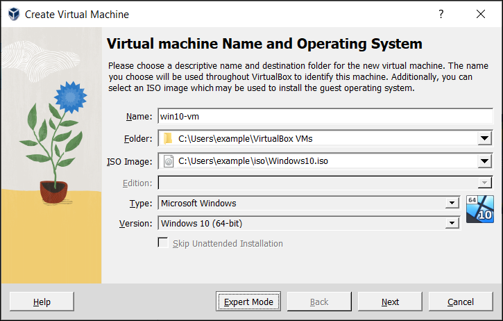
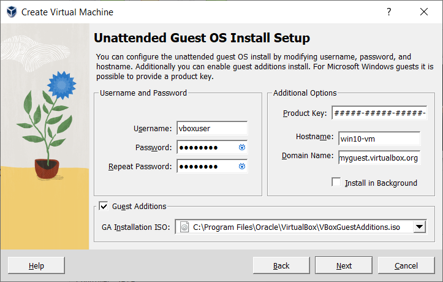
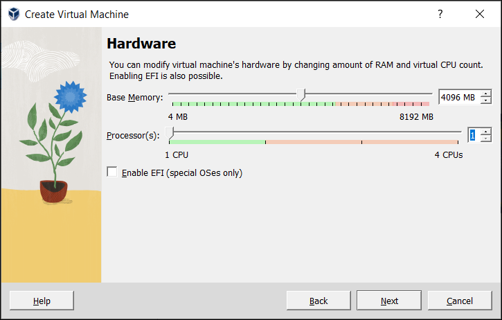
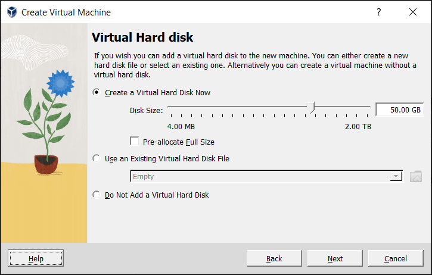
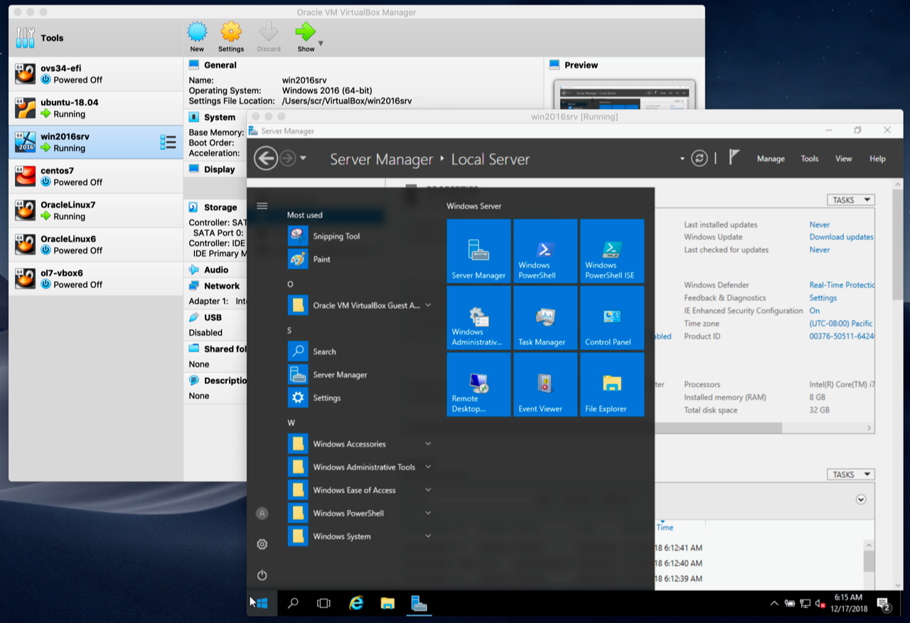
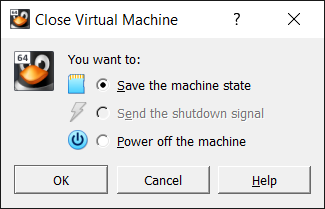

# Installing an OS in VirtualBox

This tutorial walks through the process of creating a virtual machine in **Oracle VM VirtualBox** and installing an operating system inside it. If you are new to virtualization, read [Introduction to Virtual Machines](virtual-machines.md) first for the background concepts and terminology.

The example used here is a general-purpose installation flow. The exact screens you see will vary slightly depending on your host operating system, your VirtualBox version, and the guest OS you choose.

---

## Before You Start

Before creating a VM, gather what you need:

- **VirtualBox installed** on your host computer (see [Introduction to Virtual Machines](virtual-machines.md))
- **An operating system ISO image** — a `.iso` file downloaded from the OS vendor, such as Ubuntu from [ubuntu.com](https://ubuntu.com) or Windows from Microsoft
- **Enough free disk space** — a VM's virtual hard disk can be tens of gigabytes
- **Enough free RAM** — the memory you assign to the VM is taken from your host machine while the VM is running

!!! note
    An **ISO image** is a single file containing a complete copy of an optical disc (CD/DVD). VirtualBox mounts the ISO into the VM's virtual DVD drive, and the VM boots from it to install the OS.

***

## Creating Your First Virtual Machine

Click **New** in the VirtualBox Manager window. The **Create Virtual Machine** wizard opens and guides you through the steps below.

### Name and Operating System

On the first wizard page:

- **Name** — Give the VM a name. It appears in the machine list and is used for the VM's files on disk. Use an informative name that describes the OS and software, such as `Ubuntu 24.04 Web Server`.
- **Folder** — The location where VMs are stored (the **machine folder**). Ensure it has enough free space, especially if you plan to use snapshots.
- **ISO Image** — Select the OS `.iso` file. This is used to install the OS on the new VM.
- **Type** and **Version** — Select the OS you want to install. VirtualBox uses this to enable or disable VM settings that the guest OS requires. Set it correctly — it is particularly important for 64-bit guests. If an ISO is selected and VirtualBox detects the OS, these fields are filled in automatically.
- **Skip Unattended Installation** — Tick this to disable automatic (unattended) installation and instead install the OS manually. If you skip it, the ISO is simply mounted in the virtual DVD drive for you.

Click **Next** to continue.

### (Optional) Unattended Guest OS Install

If you selected an ISO that supports **unattended installation**, this page lets VirtualBox install the guest OS automatically, with no further input from you:

- **Username and Password** — The credentials for a default user on the guest OS.
- **Guest Additions** — Enables automatic installation of the Guest Additions after the OS install.
- **Additional Options** — A **Product Key** (Windows guests only), a **Hostname**, a **Domain Name**, and **Install in Background** (headless mode, with no graphical window shown).

!!! note
    This page is optional and is not shown if you ticked **Skip Unattended Installation** on the first page. If you prefer to install the OS manually — which is a good way to learn the full installation process — skip unattended installation.

Click **Next** to continue.

### Hardware

This page configures the virtual hardware:

- **Base Memory** — The amount of RAM allocated to the VM every time it starts. This memory is taken from your host machine while the VM is running.

    !!! warning "Choose memory carefully"
        The memory you give to the VM is **not available** to your host OS while the VM runs. For example, if your host has 4 GB of RAM and you assign 2048 MB to a VM, only 2 GB remains for everything else on the host. On the other hand, a guest OS may need at least 1–2 GB just to install and boot. Always leave enough RAM for the host, or the system may slow to a standstill.

- **Processor(s)** — The number of virtual processors assigned to the VM. It is not advised to assign more than half of the total processor threads of your host machine.
- **Enable EFI** — Enables EFI (Extensible Firmware Interface) booting for the guest OS.

Click **Next** to continue.

### Virtual Hard Disk

A virtual hard disk is usually a large image file on your physical disk, presented to the VM as if it were a complete hard disk. You have three options:

- **Create a Virtual Hard Disk Now** — Creates a new empty disk image in the VM's folder. You set the **Disk Size** (maximum size) and choose whether to **Pre-Allocate Full Size**:
    - **Dynamically allocated file** (default) — grows only as the guest stores data, so it starts small and grows to the maximum size over time
    - **Fixed-size file** — occupies the full size immediately, but is slightly faster
- **Use an Existing Hard Disk File** — Select a disk image you have already created.
- **Do Not Add a Virtual Hard Disk** — Create the VM without a disk. You would need to attach one later to install an OS.

!!! tip "Sizing the disk"
    The disk must be large enough for the guest OS and the applications you plan to install. For a Windows or Linux guest, this usually means several gigabytes. The size can be changed later if needed.

Click **Next** to continue.

### Summary

The final page shows a summary of the VM's configuration. If anything is wrong, use the **Back** button to return and fix it.

Click **Finish** to create the virtual machine. The VM appears in the machine list on the left side of the VirtualBox Manager window.

***

## Running Your Virtual Machine

To start a virtual machine, you can:

- Double-click the VM's entry in the machine list
- Select the VM and click **Start** in the toolbar
- Browse to the `VirtualBox VMs` folder in your home directory, find the VM's subfolder, and double-click its `.vbox` settings file

Starting a VM opens a new window, and the VM boots up — everything that would normally appear on the virtual system's monitor is shown in the window.

### Starting a New VM for the First Time

When you start a VM for the first time, the **OS installation process starts automatically** using the ISO image you selected in the wizard.

Follow the on-screen instructions to install your OS. This is exactly the same process as installing the OS on a real computer — choosing language and region, partitioning the disk, creating a user account, and waiting for files to copy.

***

## Using the Virtual Machine

In general, you use the VM just like a real computer. There are a few points to note, described below.

### Capturing and Releasing Keyboard and Mouse

Until you install the **Guest Additions**, either the VM or the rest of your computer "owns" the keyboard and mouse — they cannot both own them at the same time. Click inside the VM window to give it control; you will see the mouse pointer become confined to the VM window.

To return control of the keyboard and mouse to your host OS, press the **Host key**. By default this is the **right Ctrl** key on Windows and Linux, and the **left Command (⌘) key** on macOS. The current Host key is always shown at the bottom right of the VM window.

!!! tip "Guest Additions fix this"
    Installing the Guest Additions inside the guest removes the separate "guest" mouse pointer and lets your normal host mouse move seamlessly in and out of the VM window.

### Typing Special Characters

Some key combinations are reserved by the host OS and will not reach the guest normally. For example, **Ctrl+Alt+Delete** usually restarts or locks your *host* machine rather than the guest.

To send these key combinations to the guest OS, use the **Input → Keyboard** menu in the VM window, or use the Host key:

| Host key combination | Sends to the guest |
|---|---|
| **Host key + Del** | Ctrl+Alt+Delete (to reboot or unlock the guest) |
| **Host key + Backspace** | Ctrl+Alt+Backspace (restarts the GUI of a Linux/Solaris guest) |
| **Host key + a function key** | Ctrl+Alt+F1–F12 (switch virtual terminals in a Linux guest) |

### Changing Removable Media

While a VM is running, use the **Devices** menu in the VM window to change what is presented as the CD, DVD, or floppy drive. This is useful because the **Settings** window is disabled while the VM is running — you can swap the ISO without shutting down the VM.

### Resizing the Machine's Window

You can resize the VM window while it runs:

- With **scaled mode** enabled (**Host key + C**, or **View → Scaled Mode**), the guest screen scales to fit the window.
- With the **Guest Additions** installed, the guest's screen resolution adjusts automatically as you resize the window.
- Otherwise, a screen larger than the window is centred or given scroll bars.

### Saving the State of the Machine

When you click the **Close** button (or press **Host key + Q**) on the VM window, VirtualBox asks what to do. The three options are quite different:

| Option | Effect |
|---|---|
| **Save the machine state** | Freezes the VM by saving its state to disk. When you start it again, it continues exactly where it left off — similar to suspending a laptop. |
| **Send the shutdown signal** | Sends an ACPI shutdown signal, the same as pressing the power button on a real computer, triggering a proper shutdown from inside the guest. |
| **Power off the machine** | Stops the VM without saving its state — equivalent to pulling the power plug. |

!!! warning "Powering off can cause data loss"
    Powering off without shutting down is like unplugging a real computer. The OS will have to reboot completely on next start and may run a lengthy disk check. Avoid this unless you need to quickly discard a VM's current state (such as when restoring a snapshot).

---

## Summary

- Before starting, install VirtualBox and download an OS **ISO image**
- Click **New** and follow the **Create Virtual Machine** wizard: name, ISO, OS type, memory, processors, and virtual hard disk
- Unattended installation can install the guest OS automatically; skipping it mounts the ISO for a manual install
- Start the VM and follow the on-screen instructions to install the OS, just like on a real computer
- Use the **Host key** (right **Ctrl**, or left **⌘** on macOS) to release the keyboard and mouse from the VM
- Use **Host key + Del** to send Ctrl+Alt+Delete to the guest
- When closing the VM, choose **Save the machine state** or **Send the shutdown signal** rather than **Power off**
