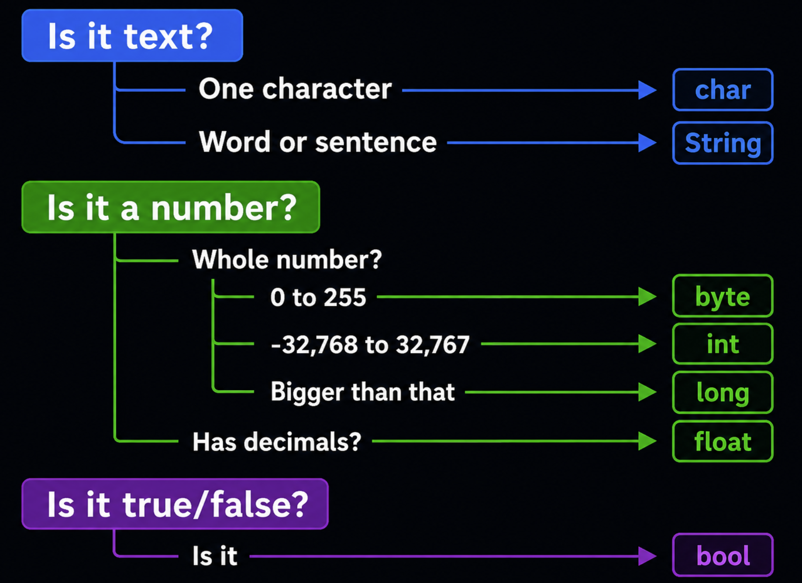

# IoT Programming Introduction

---

## The IoT Programming Workflow

Every IoT program follows the same three-step pattern:


| Step | What it means | Example |
|------|--------------|---------|
| **Input** | The device reads data from the environment | A temperature sensor sends a reading |
| **Process** | The program makes a decision or calculation | If temperature > 30, set alert = true |
| **Output** | The device acts on the result | Turn on the red LED or buzzer |

This pattern applies to every IoT project from a simple blinking LED to a smart home system.

---

## Variables and Data Types

A **variable** is a named container that stores a value in your program's memory. You can think of it like a labeled box — the label is the variable's name, and the contents are its value.

### Declaring Variables

In the Arduino programming language (C/C++) used across most microcontroller boards, including ESP32, ESP8266, and STM32, you declare a variable by specifying its **type**, **name**, and optionally an **initial value**.

**Syntax:**

```cpp
dataType variableName = value;
```

**Example:**

```cpp
int temperature = 25;       // a box labeled "temperature" holding the number 25
String name = "sensor";     // a box labeled "name" holding the text "sensor"
```

- **Type** — what kind of data it holds (`int` for whole numbers, `float` for decimals, `String` for text, `bool` for true/false)
- **Name** — how you refer to it in code
- **Value** — the data stored inside, which can change during the program

**Example:**

```cpp
int ledPin = 13;       // declare and assign
ledPin = 7;            // change (vary) its value later
```

That's why it's called a "variable" — its value can vary over time as your program runs.

---

### Data Types

A **data type** tells the program what kind of value a variable will hold. Choosing the right type matters because microcontrollers have limited memory — using the smallest type that fits your data keeps your program efficient.

> **Note:** Exact sizes depend on the board. The table below shows values for **AVR boards (Uno/Nano)**. On **ESP32/ESP8266/STM32**, `int` is 4 bytes (same range as `long`) and `double` is a true 8-byte double with more precision than `float` — always check your board if memory or precision is tight.

| Type | Size (AVR) | Range (AVR) | Best for | Example |
|------|------|-------|----------|---------|
| `int` | 2 bytes | -32,768 to 32,767 | Most whole numbers | `int count = 10;` |
| `long` | 4 bytes | -2,147,483,648 to 2,147,483,647 | Very large numbers, timestamps | `long big = 99999;` |
| `float` | 4 bytes | ±3.4e-38 to ±3.4e+38 | Decimal numbers | `float temp = 22.5;` |
| `double` | 4 bytes | Same as float on AVR (8 bytes, more precise, on ESP32/ARM) | Decimal numbers | `double x = 3.14;` |
| `char` | 1 byte | -128 to 127 (used to hold ASCII character codes 0–127) | Single characters | `char letter = 'A';` |
| `String` | varies | Any text | Words and sentences | `String s = "Hi";` |
| `bool` | 1 byte | `true` or `false` | On/off, yes/no states | `bool on = true;` |
| `byte` | 1 byte | 0 to 255 | Small positive numbers, pin values | `byte b = 255;` |

**Examples:**

```cpp
int age = 17;                // whole number
float temperature = 23.5;   // decimal number
String name = "Ali";         // text
bool isOn = true;            // true or false
char grade = 'A';            // single character
```

**Declaring without assigning a value (assign later):**

```cpp
int score;          // declared but no value yet
score = 95;         // assigned a value later
```

**Declaring multiple variables of the same type:**

```cpp
int x = 1, y = 2, z = 3;
```

---

### Variable Naming Rules

When naming variables, you must follow these rules:

| Rule | Valid | Invalid |
|------|-------|---------|
| Must start with a letter or underscore | `sensor`, `_count` | `1pin`, `9value` |
| Can only contain letters, numbers, and underscores | `led_pin`, `temp2` | `my-var`, `room temp` |
| Cannot use reserved words | `myInt`, `ledState` | `int`, `void`, `if`, `return` |
| Names are case-sensitive | `myVar` ≠ `myvar` ≠ `MYVAR` | — |

**Best practices (not required but make your code easier to read):**

- Use **camelCase** for variable names: `ledPin`, `roomTemperature`, `buttonPressed`
- Use **UPPER_CASE** for constants: `MAX_SPEED`, `LED_PIN`
- Choose **descriptive names** that explain what the variable stores

**Good vs Bad examples:**

```cpp
// ✓ GOOD names (clear, descriptive)
int ledPin = 13;
float roomTemperature = 22.5;
bool doorIsOpen = false;
int buttonCount = 0;
float sensorVoltage = 3.3;

// ✗ BAD names (avoid these)
int x = 13;           // What is x? Not descriptive
int a1b2 = 22;        // Not readable at all
int 1pin = 13;        // ERROR: Cannot start with a number
int my var = 5;       // ERROR: Cannot have spaces
int float = 10;       // ERROR: "float" is a reserved word
```

---

### Variable Scope

**Scope** determines where in your code a variable can be accessed. In C/C++, any microcontroller program written with the Arduino framework has two main scopes:

| Scope | Declared | Accessible | Lifetime |
|-------|----------|------------|----------|
| **Global** | Outside all functions (top of file) | Everywhere in the program | Entire program runtime |
| **Local** | Inside a function or block `{ }` | Only inside that function/block | Destroyed when the function/block ends |

**Basic example:**

```cpp
int globalVar = 10;    // Global — accessible EVERYWHERE

void setup() {
    int localVar = 5;  // Local — only accessible INSIDE setup()
    Serial.println(globalVar);  // ✓ Works
    Serial.println(localVar);   // ✓ Works
}

void loop() {
    Serial.println(globalVar);  // ✓ Works (global)
    Serial.println(localVar);   // ✗ ERROR! localVar does not exist here
}
```

**Block scope (inside if, for, while):**

```cpp
void loop() {
    int sensorValue = 13;  // local to loop()

    if (sensorValue > 500) {
        int warning = 1;    // local to this if-block only
        Serial.println(warning);  // ✓ Works
    }

    Serial.println(warning);  // ✗ ERROR! warning does not exist here
}
```

**Why scope matters — a practical example:**

```cpp
int count = 0;  // Global: keeps its value between loop() cycles

void loop() {
    count++;    // increases by 1 each time loop() runs
    Serial.println(count);  // prints 1, 2, 3, 4...

    int temp = 13;  // Local: created fresh every loop() cycle
}
```

> **Tip:** Use **local** variables whenever possible. Only use **global** variables when you need to share data between functions or keep a value between `loop()` cycles.

---

### Constants (Values that Never Change)

A **constant** is a variable whose value is **locked** once set — it cannot be changed anywhere in the program.

Use constants for values that should stay fixed, like pin numbers or physical values.

**Why use constants instead of regular variables?**

| | Variable | Constant |
|--|----------|----------|
| Can change value? | Yes | No — locked at declaration |
| Risk of accidental change? | Yes | No — compiler catches it |
| Best for | Values that change (sensor readings, counters) | Fixed values (pin numbers, thresholds) |

**Syntax — use the `const` keyword:**

```cpp
const dataType NAME = value;
```

**Examples:**

```cpp
const int LED_PIN = 13;           // pin number never changes
const int BUTTON_PIN = 2;         // pin number never changes
const int MAX_SPEED = 255;        // PWM maximum value
```

**What happens if you try to change a constant:**

```cpp
const int LED_PIN = 13;
LED_PIN = 12;  // ✗ COMPILE ERROR! Cannot modify a constant
```

**Example — constants vs variables together:**

```cpp
const int SENSOR_PIN = 6;      // constant: pin won't change
const int THRESHOLD = 500;     // constant: limit won't change

int sensorValue = 0;           // variable: reading changes every cycle

void loop() {
    sensorValue = analogRead(SENSOR_PIN);  // variable updates each loop

    if (sensorValue > THRESHOLD) {
        Serial.println("Above threshold!");
    }
}
```

**Another way to define constants — `#define`:**

```cpp
#define LED_PIN 13
#define MAX_SPEED 255
```

> **Note:** Use `const` instead of `#define` where possible — `const` is type-checked by the compiler, while `#define` is a simple text substitution.

**Naming convention:** Use **UPPER_CASE** with underscores for constants to visually distinguish them from regular variables.

---

### How to Choose the Right Type

Use this flowchart to pick the smallest data type that fits your value:



### Example: Variables in a Circuit

Open this Wokwi simulation to see variables and data types used in a working circuit:
[https://wokwi.com/projects/470387372012322817](https://wokwi.com/projects/470387372012322817)
