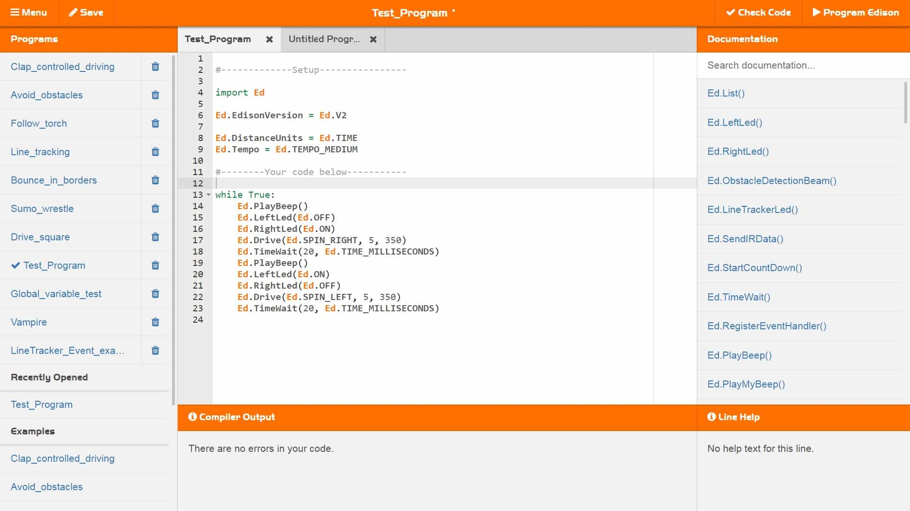

# EdPy Programming Environment
## Overview
**EdPy** is a text-based programming language used to control the Edison Robot. It uses simple Python-style syntax to write programs that control the robot’s motors, sensors, sounds, and lights. EdPy programs are written using the [EdPy Programming Environment](https://www.edpyapp.com/v3/), where code can be created, edited, and then transferred to the robot to run.

[Click here to access EdPy](https://www.edpyapp.com/v3/){ .md-button }

## Preview
