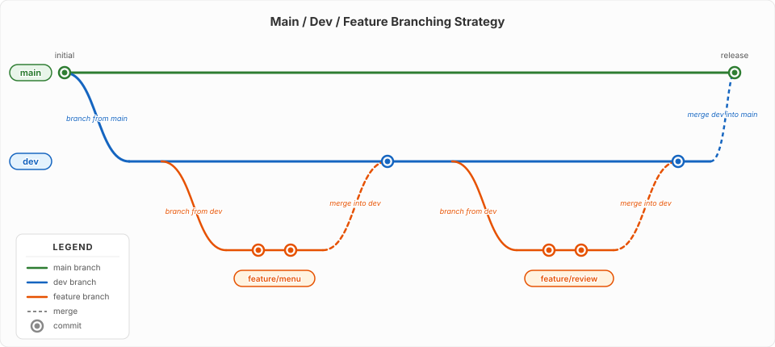

# Branching Strategy

Branches let you work on new features without risking the stable version of your code. A good branching strategy keeps your project organised and your main code always working.

---

## What is a Branch?

A branch is a separate line of development. Think of it as a copy of your project where you can experiment, build features, or fix bugs without affecting the main codebase.

When you are happy with your changes, you merge the branch back into the main code.

---

## Common Branching Strategies

There is no single correct way to organise branches. Different teams and projects use different strategies depending on their size, release cadence, and risk tolerance.

### Git Flow

A more structured approach with long-lived branches: `main`, `develop`, `release`, `hotfix`, and `feature` branches. Suited to projects with scheduled releases.

### Trunk-Based Development

Developers work on short-lived branches (or directly on `main`/`trunk`) and merge frequently — sometimes multiple times a day. Popular in continuous deployment environments.

### Main / Staging / Dev / Feature

Adds a staging branch to the main/dev/feature model so changes can be tested in a production-like environment before going live. Useful when you need extra confidence before releasing.

### Main / Dev / Feature

A simpler model with just three branch types. Easy to learn, effective for small to medium teams, and the strategy we will focus on throughout this site.

---

## The Main / Dev / Feature Strategy

This simple branching model uses three types of branches:



### `main`

The production branch. This is what is live or ready to deploy. Only tested, working code goes here.

- Never work directly on `main`
- Always merge into `main` from `dev`

### `dev`

The development branch where changes come together before they reach `main`. All feature branches merge into `dev` first.

- Your day-to-day integration branch
- Test everything here before merging to `main`

### `feature` Branches

Short-lived branches for building one specific thing. Created from `dev` and merged back into `dev` when complete.

- Name them after what you are building: `feature/add-login`, `feature/menu-page`
- Keep them focused — one feature per branch
- Delete after merging

---

## Why Use This Strategy?

!!! note "Benefits"
    - **Main stays stable** — broken code never reaches the main branch
    - **Work in parallel** — multiple features can be built at the same time
    - **Safe to experiment** — if a feature does not work out, delete the branch
    - **Clear history** — each feature appears as a separate set of changes

---

## Working with Branches in VS Code

### Creating a Feature Branch

1. Click the branch name in the bottom-left corner of VS Code
2. Select **Create new branch**
3. Name it `feature/your-feature-name`
4. Start working on your feature

### Switching Between Branches

Click the branch name in the bottom-left corner and select the branch you want from the list.

### Merging in VS Code

1. Switch to the branch you want to merge **into** (e.g. `dev`)
2. Open the Source Control panel
3. Click the **...** (more actions) menu
4. Select **Branch** > **Merge**
5. Choose the branch you want to merge **from** (e.g. `feature/add-login`)

!!! warning
    Always switch to the target branch first, then merge the source branch into it. For example: switch to `dev`, then merge `feature/add-login` into `dev`.

---

## A Typical Workflow

The full cycle from idea to production follows these steps:

```
1. Switch to dev and pull latest:      Sync Changes
2. Create a feature branch:            feature/add-menu-page
3. Build the feature, commit often
4. Push the feature branch to GitHub:  Sync Changes
5. Open a pull request on GitHub
   merging feature/add-menu-page → dev
6. Review the changes and confirm
   everything looks good
7. Merge the pull request into dev
8. Delete the feature branch
9. When dev is tested and stable,
   open a pull request merging
   dev → main
```

### Why Pull Requests?

A pull request (PR) is a GitHub feature that lets you propose changes and have them reviewed before they are merged. Instead of merging directly in VS Code, a PR lets you:

- **Review the diff** — see exactly what changed before it lands on `dev`
- **Discuss changes** — teammates can leave comments and suggestions
- **Run automated checks** — CI tools can verify the code builds and tests pass
- **Keep a record** — every PR documents why a change was made and who approved it

For solo projects, the PR is still valuable as a final checkpoint before merging — a moment to review your own work with fresh eyes.

### Merging dev into main

When `dev` has been tested and is ready to go live, the same PR process is used to merge into `main`. This keeps `main` as the single source of truth for what is deployed to production.

!!! tip
    Commit early and often. Small commits are easier to understand and undo than large ones. A good rule: commit after every meaningful change — a new page, a styled section, a working function.

---

## Summary

- `main` — stable, production-ready code. Do not work on it directly.
- `dev` — integration branch where features come together
- `feature/<name>` — short-lived branches for one feature each
- Create branches from `dev`, open a pull request to merge back into `dev`
- Open a pull request to merge `dev` into `main` when you are ready to release
- All of this is done through the VS Code interface and GitHub
